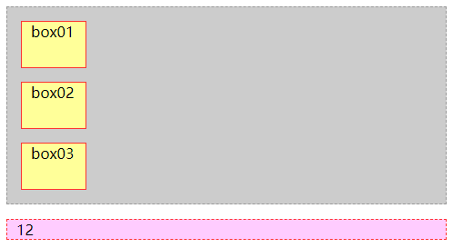
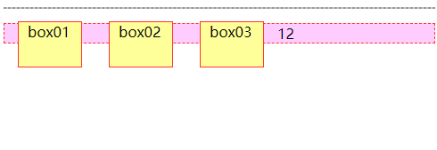
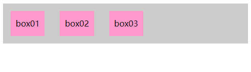

## DOM文档排版的特点

块级元素只能垂直排版，行内元素只能水平排版。

块级元素可以设置宽高属性，行内元素没有宽高属性，只能被内部元素撑起来，水平放置不下时会换行继续排版。

## CSS 浮动

浮动就是让文档脱离文档流，在父元素内部可以移动到指定位置。

浮动的元素可以设置宽高，像块级元素一样，又向行内元素一样可以水平排版。

```html
<!doctype html>
<html>
<head>
<meta charset="utf-8">
<title>元素的浮动</title>
<style type="text/css">
/*定义父元素的样式*/
.father {
    background: #ccc;
    border: 1px dashed #999;
}

/*定义 box01、 box02、 box03 三个盒子的样式*/
.box01, .box02, .box03 {
    height: 50px;
    width: 50px;
    background: #FF9;
    border: 1px solid #F33;
    margin: 15px;
    padding: 0px 10px;
}

/*定义段落文本的样式*/
p {
    background: #FCF;
    border: 1px dashed #F33;
    padding: 0px 10px;
}
</style>
<style>
.box01, .box02, .box03 {
    float: left;
}
</style>
</head>
<body>
    <div class="father">
        <div class="box01">box01</div>
        <div class="box02">box02</div>
        <div class="box03">box03</div>
    </div>
    <p>12</p>
<!--不定义float属性，float属性值都为其默认值 none-->
</body>
</html>
```

<center>



</center>

运行后，box01、box02、box03 及段落文本从上到下一一罗列。 可见如果不对元素设置浮动，则该元素及其内部的子元素将按照标准文档流的样式显示，即块元素占据页面整行。

接下来以 box01 为设置对象，对其应用左浮动样式，在 head 的 style 标签下添加新的 style 标签，具体CSS代码如下：

```css
.box01 {
    float: left;
}
```

可以看到 box01 已经脱离了文档流，接下来为 box02 和 box03 设置左浮动：

```css
.box02 {
    float: left;
}

.box03 {
    float: left;
}
```

<center>



</center>

上述代码运行后，box01、 box02、 box03 三个盒子排列在同一行，同时，周围的段落文本将环绕盒子，出现了图文混排的网页效果。

### CSS 浮动清除

由于浮动元素不占用原文档流的位置，使用浮动时会影响后面相邻的固定元素。

CSS 提供了 clear 属性，可以清除掉浮动元素。

`clear` 有三个属性值：

`left` ：不允许左侧有浮动元素(清除左侧浮动的影响)

`right` ：不允许右侧有浮动元素(清除右侧浮动的影响)

`both` ：同时清除左右两侧浮动的影响

浮动清除存在一个问题，浮动清除本质上处理的是左右元素，如果父元素内所有的元素都浮动了，此时因为文档流中没有其他元素可以在内部撑起父元素的高度，父元素此时会坍缩为 0 高度。

#### **方法一**：使用空标记清除浮动

在浮动元素之后添加空标记，并对该标记应用  `clear:both` 样式，可清除元素浮动所产生的影响，这个空标记可以为 `<div>` 、 `<p>` 、 `<hr />` 等任何标记。

需要注意的是，上述方法虽然可以清除浮动， 但是在无形中增加了毫无意义的结构元素(空标记)，因此在实际工作中不建议使用。

(空标记)因此在实际工作中不建议使用。

```html
<!doctype html>
<html>
<head>
<meta charset="utf-8">
<title>空标记清除浮动</title>
<style type="text/css">
/*没有给父元素定义高度*/
.father {
    background: #ccc;
    border: lpx dashed #999;
}

/*定义box01、box02、box03三个盒子左浮动*/
.box01, .box02, .box03 {
    height: 50px;
    line-height: 50px;
    background: #f9c;
    border:1px dashed 999;
    margin: 15px;
    padding: 0px 10px;
    float: left;
}

/*对空标记应用clear:both;*/
.box04 {
    clear: both;
}
</style>
</head>
<body>
    <div class="father">
        <div class="box01">box01</div>
        <div class="box02">box02</div>
        <div class="box03">box03</div>
        <div class="box04"></div>
        <!--在浮动元素后添加空标记-->
    </div>
</body>
</html>
```

<center>



</center>

#### **方法二**：使用 overflow 属性清除浮动

对元素应用 `overflow: hidden;` 也可以清除浮动对该元素的影响，该方法弥补了空标记清除浮动的不足。

对父元素应用 `overflow: hidden;` 样式来清除子元素浮动对父元素的影响。

父元素又被其子元素撑开了，即子元素浮动对父元素的影响已经不存在。

```html
<!doctype html>
<html>
<head>
<meta charset="utf-8">
<title>overflow属性清除浮动</title>
<style type="text/css">

/*没有给父元素定义高度*/
.father {
    background: #ccc;
    border: 1px dashed #999;
    /*对父元素应用overflow:hidden;*/
    overflow: hidden;
}

/*定义box01、box02、box03三个盒子左浮动*/
.box01, .box02, .box03 {
    height: 50px;
    line-height: 50px;
    background: #f9c;
    border: 1px dashed #999;
    margin: 15px;
    padding: 0px 10px;
    float: left;
}
</style>
</head>
<body>
    <div class="father">
        <div class="box01">box01</div>
        <div class="box02">box02</div>
        <div class="box03">box03</div>
    </div>
</body>
</html>
```

<center>


</center>

#### **方法三**: 使用 after 伪对象清除浮动

使用 `after` 伪对象也可以清除浮动，但是该方法只适用于 IE8 及以上版本浏览器和其他非 IE 浏览器。

另外，使用 `after` 伪对象清除浮动时需要注意：

(1) 必须为需要清除浮动的元素伪对象设置 `height: ();` 样式，否则该元素会比其实际高度高出若干像素。

(2) 必须在伪对象中设置 `content` 属性，属性值可以为空，如 `content：" ";` 。

```html
<!doctype html>
<html>
<head>
<meta charset="utf-8">
<title>使用after伪对象清除浮动</title>
<style type="text/css">

/*没有给父元素定义高度*/
.father {
background: #ccc;
border: 1px dashed #999;
}

/*对父元素应用after伪对象样式*/
.father:after {
    display: block;
    clear: both;
    content:" ";
    visibility: hidden;
    height: 0;
}

/*定义box01、box02、box03三个盒子左浮动*/
.box01, .box02, .box03 {
    height: 50px;
    line-height: 50px;
    background: #f9c;
    border: 1px dashed #999;
    margin: 15px;
    padding: 0px 10px;
    float: left;
}

</style>
</head>
<body>
    <div class="father">
        <div class="box01">box01</div>
        <div class="box02">box02</div>
        <div class="box03">box03</div>
    </div>
</body>
</html>
```

<center>


</center>
