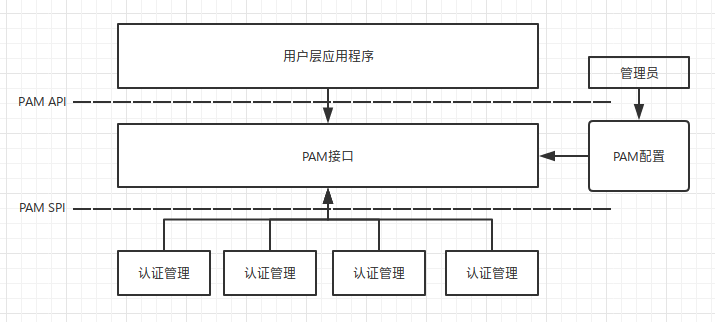

本文会基础的介绍一下PAM是什么，让你能够回答PAM是什么、PAM有什么用、如何根据需求自己开发PAM模块。

### PAM是什么

PAM即可插拔认证模块。它提供了一个所有服务的中心验证机制，适用于普通登录、ssh登录等需要进行身份认证的系统中。

<!-- more -->

### 为什么使用PAM

为了安全起见，计算机只能给通过授权的用户进行使用，在创建用户时，密码会被加密保存在/etc/passwd中,在用户登录时，重新计算密码，然后在/etc/passwd中进行对比。

除了上面这种，还有其他方式的验证，比如现在经常使用的指纹认证，其核心思想都是检查内容是否匹配。但是这些方案都有一些通病，那就是需要随着应用程序一起编译来使用，如果认证系统有问题，或者更新了算法，就需要重新编译才能使用。

> 鉴于以上原因，人们开始寻找一种更佳的替代方案：一方面，将鉴别功能从应用中独立出来，单独进行模块化设计，实现和维护；另一方面，为这些鉴别模块建立标准 API，以便各应用程序能方便的使用它们提供的各种功能；同时，鉴别机制对其上层用户（包括应用程序和最终用户）是透明的。

### PAM是如何工作的



PAM采用了分层的模块式开发，提供了四种类型的模块:

- 认证管理
- 账号管理
- 会话管理
- 口令管理

这四个接口就可以满足用户的认证和管理。一个模块可以同时属于多种类型，只需实现对应的函数就可以。

目前PAM的实现有以下三种：
>1. Linux-PAM: Linux-PAM 涵盖了本文中讨论的所有 PAM。在任何一个 Linux 平台中的 PAM 的主要结构都类似于 Linux-PAM 版本。
>2. OpenPAM: OpenPAM 是由 NAI 实验室的 Dag-Erling Smorgrav 开发的另一个 PAM 实现，属于 DARPA-CHATS 研究项目。由于它是开源的，因此它主要由 FreeBSD、NetBSD 及应用程序（加上 Mac OS X）使用。
>3. Java™ PAM 或 JPam: PAM 主要是支持 Linux 和 UNIX 的标准验证模块。JPam 将 Java 部分与普通 PAM 联系了起来。JPam 允许基于 Java 的应用程序使用 PAM 模块或工具（如 auth、account、passwd、session 等）。它提供了 JAAS 和直接 API，并且支持大多数 Unix OS 和架构。

虽然有不同的PAM实现，但是主要功能都是类似的，完成用户的验证。

想要了解更多，可查看IBM的文档库。
[深入 Linux PAM 体系结构](https://www.ibm.com/developerworks/cn/linux/l-cn-pam/index.html)

### 如何自己开发PAM模块

PAM模块使用一个pam_handle类型的结构当做句柄，也是唯一一个PAM和程序进行通信的结构。

首先在编写的服务模块的源程序里要包含下列头文件：

```
#include <security/pam_modules.h>
```

PAM模块是一个个的so动态库。PAM会通过dlopen来装载这些so。四个模块分别需要实现对应的方法，PAM会根据配置文件来调用这些方法。

每个PAM模块的认证程序都以pam_start开始，以pam_end结束。PAM还提供了pam_get_item和pam_set_item共享有关认证会话的某些公共信息，例如用户名、服务名和密码。应用程序在调用了pam_start以后可以用这些APIs来改变状态信息。实际工作的函数有6个：

模块类型 | 函数 | 功能
---- | ---- | ----
认证管理 | PAM_EXTERN int pam_sm_authenticate(pam_handle_t *pamh, int flags, int argc, const char **argv) | 认证用户
认证管理 |  PAM_EXTERN int pam_sm_setcred(pam_handle_t *pamh, int flags, int argc, const char **argv) | 设置用户证书
账号管理 | PAM_EXTERN int pam_sm_acct_mgmt(pam_handle_t *pamh, int flags, int argc, const char **argv) | 账号管理
会话管理 | PAM_EXTERN int pam_sm_open_session(pam_handle_t *pamh, int flags, int argc, const char **argv) | 打开会话
会话管理 | PAM_EXTERN int pam_sm_close_session(pam_handle_t *pamh, int flags, int argc, const char **argv) | 关闭会话
口令管理 | PAM_EXTERN int pam_sm_chauthtok(pam_handle_t *pamh, int flags, int argc, const char **argv) | 设置口令

同一个模块可以同时支持不同的类型，可以一个模块全部实现这些方法，也可以实现部分。PAM自带的pam_unix.so就是支持四种类型。

在函数内进行详细的操作，最后返回结果，即可完成整个验证流程。

### 配置PAM

PAM的配置通常在/etc/pam.d/下。

模块将按照在配置文件中列出的顺序被调用，这取决于每个条目允许的 Control_flag 的值。Control_flag 值包括：

> Required：堆栈中的所有 Required 模块必须看作一个成功的结果。如果一个或多个 Required 模块失败，则实现堆栈中的所有 Required 模块，但是将返回第一个错误。
>
>Sufficient：如果标记为 sufficient 的模块成功并且先前没有 Required 或 sufficient 模块失败，则忽略堆栈中的所有其余模块并返回成功。
>
>Optional：如果堆栈中没有一个模块是 required 并且没有任何一个 sufficient 模块成功，则服务/应用程序至少要有一个 optional 模块成功。

### 在程序中使用PAM进行验证

1. 开发PAM验证模块

```
#include <security/pam_appl.h>
#include <security/pam_modules.h>
#include <stdio.h>

// 只实现账户认证
PAM_EXTERN int pam_sm_authenticate(pam_handle_t *pamh, int flags, int argc,
                                   const char **argv) {
  char *username;
  char password[256];

  //得到用户名
  pam_get_user(pamh, &username, "Username: ");

  // 得到密码
  printf("Password: ");
  gets(password);

  // 测试判断，如果用户名和密码不相等，就认证失败
  if (strcmp(username, password) != 0) {
    return PAM_AUTH_ERR;
  }

  printf("Password is: %s\n", password);
  return PAM_SUCCESS;
}
```

编译:

```
gcc -fPIC -fno-stack-protector -c pam_test_mod.c
sudo ld -x --shared -o /lib/security/pam_test_mod.so pam_test_mod.o
```

还需要修改pam的配置，来加载这个so。编辑/etc/pam.d/common-auth

```
auth [success=1 default=ignore] pam_test_mod.so
```

这里的success的值需要根据实际情况来调整，必须是所有里面的最大值。

2. 使用模块进行验证

```
// PAM必须的两个头文件
#include <iostream>
#include <security/pam_appl.h>
#include <security/pam_misc.h>

using namespace std;

extern int misc_conv(int num_msg, const struct pam_message **msgm,
                     struct pam_response **response, void *appdata_ptr) {

  return PAM_SUCCESS;
}

const struct pam_conv conv = {misc_conv, NULL};

int main(int argc, char *argv[]) {
  // 初始化
  pam_handle_t *pamh = NULL;
  int retval;
  const char *username = argv[1];

  // 初始化PAM 设置common-auth为验证配置
  if ((pam_start("common-auth", username, &conv, &pamh)) != PAM_SUCCESS) {
    return -1;
  }

  // //认证用户
  retval = pam_authenticate(pamh, 0);

  cout << (retval == PAM_SUCCESS ? "SUCCESS\n" : "Failed\n") << endl;

  // // 结束PAM
  if (pam_end(pamh, retval) != PAM_SUCCESS) {
    cout << "check_user: failed to release authenticator\n" << endl;
    return -1;
  }

  return retval == PAM_SUCCESS ? 0 : 1;
}
```

编译测试一下:

```
g++ -o pam_test pam_test.cc -lpam -lpam_misc
sudo ./pam_test $USER
```

输出为：

```
$ ./pam_test test       
Password: test
Password is: test
SUCCESS
```

### 总结

基于PAM认证体系，我们可以根据自己的需求任意的扩展linux账户，linux下的pbis-open，就是基于PAM扩展出来的一个AD域登录模块，它提供了一个pam_lsass.so的文件，来进行账户的验证。我们也可以自己设计一套认证流程，只需要满足上面的接口要求就可以。

> 提供机制，而非策略