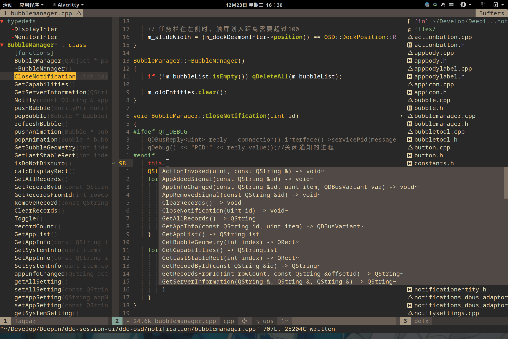

LSP(Language Server Protocol) 语言服务协议，此协议定义了在编辑器或IDE与语言服务器之间使用的协议，该语言服务器提供了例如自动补全，转到定义，查找所有引用等的功能；语言服务器索引格式的目标是支持在开发工具中进行丰富的代码导航或者一个无需本地源码副本的WebUI。

而ccls就是为c/c++开发的一个的lsp服务，可以为vim、emacs和vscode等工具提供自动补全，定义跳转等功能。

根据本文的指导，你可以将vim配置成一个不错的c++开发工具。

# 准备工作

由于公司部分项目并不是CMake开发的，所以vscode无法完成胜任开发工作，所以我开始使用vim。系统我使用的是ArchLinux,我会尽量使用仓库中的包，而不是通过pip等工具安装组件。

# 安装

安装neovim、ccls和bear,bear目前只在archlinuxcn仓库，需要注意。

```plain
sudo pacman -S neovim ccls bear python node
```
下载SpaceVim，由于我使用的是neovim,所以下载配置时选择了neovim.
```plain
curl -sLf https://spacevim.org/cn/install.sh | bash -s -- --install neovim
```
创建自己的配置文件目录
```plain
mkdir ~/.SpaceVim.d/
```
# 配置

首先要先创建基本的SpaceVim配置文件，配置文件参考了[https://github.com/Martins3/My-Linux-config](https://github.com/Martins3/My-Linux-config)。

整个配置都在~/.SpaceVim.d目录下。

```plain
.SpaceVim.d
├── autoload
│   └── myspacevim.vim
├── coc-settings.json
├── init.toml
└── plugin
    ├── coc.nvim
    └── defx.nvim
2 directories, 5 files
```
在.SpaceVim.d目录下创建init.toml
```plain
# 所有的 SpaceVim 选项都列在 [options] 之下
[options]
    # 设置 SpaceVim 主题及背景，默认的主题是 gruvbox，如果你需要使用更
    # 多的主题，你可以载入 colorscheme 模块
    colorscheme = "gruvbox"
    # 背景可以取值 "dark" 或 "light"
    colorscheme_bg = "dark"
    # 启用/禁用终端真色，在目前大多数终端下都是支持真色的，当然也有
    # 一小部分终端不支持真色，如果你的 SpaceVim 颜色看上去比较怪异
    # 可以禁用终端真色，将下面的值设为 false
    enable_guicolors = true
    # 设置状态栏上分割符号形状，如果字体安装失败，可以将值设为 "nil" 以
    # 禁用分割符号，默认为箭头 "arrow"
    statusline_separator = "nil"
    statusline_iseparator = "bar"
    # 设置顶部标签列表序号类型，有以下五种类型，分别是 0 - 4
    # 0: 1 ➛ ➊
    # 1: 1 ➛ ➀
    # 2: 1 ➛ ⓵
    # 3: 1 ➛ ¹
    # 4: 1 ➛ 1
    buffer_index_type = 4
    # 显示/隐藏顶部标签栏上的文件类型图标，这一图标需要安装 nerd fonts，
    # 如果未能成功安装这一字体，可以隐藏图标
    enable_tabline_filetype_icon = true
    # 是否在状态栏上显示当前模式，默认情况下，不显示 Normal/Insert 等
    # 字样，只以颜色区分当前模式
    enable_statusline_mode = false
    filemanager = "defx"
    autocomplete_method = "coc"
    bootstrap_before = "myspacevim#before"
    bootstrap_after = "myspacevim#after"
# SpaceVim 模块设置，主要包括启用/禁用模块
# 计算器 日历 书签等小工具
[[layers]]
  name = 'tools'
[[layers]]
  name = "checkers"
  enable = false
# 版本控制
[[layers]]
  name = "VersionControl"
  enable-gtm-status = true
[[layers]]
  name = "git"
  git-plugin = "fugitive"
[[layers]]
  name = "fzf"
# coc.nvim 核心配置，不要删除
[[custom_plugins]]
  name = 'neoclide/coc.nvim'
  merge = 0
# 主要用于快速搜索 文件, buffer 和 函数
[[custom_plugins]]
    name = "Yggdroot/LeaderF"
    build = "./install.sh"
# 更加美观的 tagbar
[[custom_plugins]]
    name = 'liuchengxu/vista.vim'
[[custom_plugins]]
    name = 'junegunn/fzf.vim'
# 更加方便的调节窗口的大小
[[custom_plugins]]
    name = 'simeji/winresizer'
# 基于lsp的高亮插件
[[custom_plugins]]
    name = 'jackguo380/vim-lsp-cxx-highlight'
# 从 http://cplusplus.com/ 和 http://cppreference.com/ 获取文档
[[custom_plugins]]
    name = 'skywind3000/vim-cppman'
# 利用 git blame 显示当前行的 commit message
[[custom_plugins]]
    name = 'rhysd/git-messenger.vim'
    lazy =  1
    on_cmd = 'GitMessenger'
# 以悬浮窗口的形式打开终端
[[custom_plugins]]
    name = 'voldikss/vim-floaterm'
# 显示搜索的标号
[[custom_plugins]]
    name = 'google/vim-searchindex.git'
[[custom_plugins]]
  name = 'kenn7/vim-arsync'
[[custom_plugins]]
  name = 'fatih/vim-go'
# 禁用 shell 模块，禁用模块时，需要加入 enable = false
[[layers]]
    name = "shell"
    enable = false
# 添加自定义插件
[[custom_plugins]]
    repo = "lilydjwg/colorizer"
    merged = false
[[layers]]
  name = "format"
```
创建plugin目录，新建两个文件。
coc.nvim

```plain
" coc.nvim 的配置, 来自于 https://github.com/neoclide/coc.nvim
" Use <c-space> for trigger completion.
inoremap <silent><expr> <c-space> coc#refresh()
set hidden
" Some servers have issues with backup files, see #649
set nobackup
set nowritebackup
" 使用 Microsoft Python Language Server 不然 coc.nvim 会警告
call coc#config("python.jediEnabled", v:false)
call coc#config("smartf.wordJump", v:false)
call coc#config("smartf.jumpOnTrigger", v:false)
" https://rust-analyzer.github.io/manual.html#rust-analyzer-language-server-binary
call coc#config("rust-analyzer.serverPath", "~/.cargo/bin/rust-analyzer")
call coc#config('coc.preferences', {
			\ "autoTrigger": "always",
			\ "maxCompleteItemCount": 10,
			\ "codeLens.enable": 1,
			\ "diagnostic.virtualText": 1,
			\})

" coc.nvim 插件，用于支持 python java 等语言
let s:coc_extensions = [
			\ 'coc-python',
			\ 'coc-java',
			\ 'coc-json',
      \ 'coc-css',
      \ 'coc-html',
      \ 'coc-word',
      \ 'coc-cmake',
      \ 'coc-dictionary',
      \ 'coc-rust-analyzer',
      \ 'coc-vimlsp',
      \ 'coc-ci',
      \ 'coc-snippets',
      \ 'coc-vimtex',
      \ 'coc-smartf',
			\]
for extension in s:coc_extensions
	call coc#add_extension(extension)
endfor
inoremap <silent><expr> <TAB>
      \ pumvisible() ? "\<C-n>" :
      \ <SID>check_back_space() ? "\<TAB>" :
      \ coc#refresh()
inoremap <expr><S-TAB> pumvisible() ? "\<C-p>" : "\<C-h>"
function! s:check_back_space() abort
  let col = col('.') - 1
  return !col || getline('.')[col - 1]  =~# '\s'
endfunction
" 方便在中文中间使用 w 和 b 移动
nmap <silent> w <Plug>(coc-ci-w)
nmap <silent> b <Plug>(coc-ci-b)

" Use <cr> for confirm completion, `<C-g>u` means break undo chain at current position.
" Coc only does snippet and additional edit on confirm.
inoremap <expr> <cr> pumvisible() ? "\<C-y>" : "\<C-g>u\<CR>"
" Remap keys for gotos
nmap <silent> gd <Plug>(coc-definition)
nmap <silent> gy <Plug>(coc-type-definition)
nmap <silent> gi <Plug>(coc-implementation)
nmap <silent> gr <Plug>(coc-references)
" Use K for show documentation in preview window
nnoremap <silent> K :call <SID>show_documentation()<CR>
function! s:show_documentation()
  if &filetype == 'vim'
    execute 'h '.expand('<cword>')
  else
    call CocAction('doHover')
  endif
endfunction
" Highlight symbol under cursor on CursorHold
set updatetime=300
autocmd CursorHold * silent call CocActionAsync('highlight')
autocmd CursorHoldI * sil call CocActionAsync('showSignatureHelp')
" Remap for rename current word
nmap <leader>rn <Plug>(coc-rename)
" 注释掉，一般使用 `Space` `r` `f` 直接格式化整个文件
" Remap for format selected region
" vmap <leader>f  <Plug>(coc-format-selected)
" nmap <leader>f  <Plug>(coc-format-selected)
augroup mygroup
  autocmd!
  " Setup formatexpr specified filetype(s).
  autocmd FileType typescript,json setl formatexpr=CocAction('formatSelected')
  " Update signature help on jump placeholder
  autocmd User CocJumpPlaceholder call CocActionAsync('showSignatureHelp')
augroup end
" Remap for do codeAction of selected region, ex: `<leader>aap` for current paragraph
vmap <leader>a  <Plug>(coc-codeaction-selected)
nmap <leader>a  <Plug>(coc-codeaction-selected)
" Remap for do codeAction of current line
nmap <leader>ac  <Plug>(coc-codeaction)
" Fix autofix problem of current line
nmap <leader>qf  <Plug>(coc-fix-current)
" Use `:Format` for format current buffer
" command! -nargs=0 Format :call CocAction('format')
call SpaceVim#custom#SPC('nnoremap', ['r', 'f'], "call CocAction('format')", 'format file with coc.nvim', 1)
" Use `:Fold` for fold current buffer
command! -nargs=? Fold :call     CocAction('fold', <f-args>)
" auto import for go on save
autocmd BufWritePre *.go :call CocAction('runCommand', 'editor.action.organizeImport')
" 这个和 SpaceVim 的 statusline/tabline 冲突了
" Add diagnostic info for https://github.com/itchyny/lightline.vim
" let g:lightline = {
"       \ 'colorscheme': 'wombat',
"       \ 'active': {
"       \   'left': [ [ 'mode', 'paste' ],
"       \             [ 'cocstatus', 'readonly', 'filename', 'modified' ] ]
"       \ },
"       \ 'component_function': {
"       \   'cocstatus': 'coc#status'
"       \ },
"       \ }

" Using CocList
" Show all diagnostics
nnoremap <silent> <leader>d  :<C-u>CocList diagnostics<cr>

" 下面是 ccls 提供的 LSP Extension
" https://github.com/MaskRay/ccls/wiki/coc.nvim
" Manage extensions
" nnoremap <silent> <space>e  :<C-u>CocList extensions<cr>
" Show commands
" nnoremap <silent> <space>c  :<C-u>CocList commands<cr>
" Find symbol of current document
" nnoremap <silent> <space>o  :<C-u>CocList outline<cr>
" Search workspace symbols
" nnoremap <silent> <space>s  :<C-u>CocList -I symbols<cr>
" Do default action for next item.
" nnoremap <silent> <space>j  :<C-u>CocNext<CR>
" Do default action for previous item.
" nnoremap <silent> <space>k  :<C-u>CocPrev<CR>
" Resume latest coc list
" nnoremap <silent> <space>p  :<C-u>CocListResume<CR>
nn <silent> xl :call CocLocations('ccls','$ccls/navigate',{'direction':'D'})<cr>
nn <silent> xk :call CocLocations('ccls','$ccls/navigate',{'direction':'L'})<cr>
nn <silent> xj :call CocLocations('ccls','$ccls/navigate',{'direction':'R'})<cr>
nn <silent> xh :call CocLocations('ccls','$ccls/navigate',{'direction':'U'})<cr>
noremap x <Nop>
nn <silent> xb :call CocLocations('ccls','$ccls/inheritance')<cr>
" bases of up to 3 levels
nn <silent> xb :call CocLocations('ccls','$ccls/inheritance',{'levels':3})<cr>
" derived
nn <silent> xd :call CocLocations('ccls','$ccls/inheritance',{'derived':v:true})<cr>
" derived of up to 3 levels
nn <silent> xD :call CocLocations('ccls','$ccls/inheritance',{'derived':v:true,'levels':3})<cr>
" caller
nn <silent> xc :call CocLocations('ccls','$ccls/call')<cr>
" callee
nn <silent> xC :call CocLocations('ccls','$ccls/call',{'callee':v:true})<cr>
" $ccls/member
" member variables / variables in a namespace
nn <silent> xm :call CocLocations('ccls','$ccls/member')<cr>
" member functions / functions in a namespace
nn <silent> xf :call CocLocations('ccls','$ccls/member',{'kind':3})<cr>
" nested classes / types in a namespace
nn <silent> xs :call CocLocations('ccls','$ccls/member',{'kind':2})<cr>
nmap <silent> xt <Plug>(coc-type-definition)<cr>
nn <silent> xv :call CocLocations('ccls','$ccls/vars')<cr>
nn <silent> xV :call CocLocations('ccls','$ccls/vars',{'kind':1})<cr>
nn xx x
```
defx.nvim
```plain
" defx 将会自动忽略如下的文件
call defx#custom#option('_', {
    \ 'ignored_files': ".*,*.class,*.out,*.o,*.bc,*.a,compile_commands.json,*.d,*.mod*,*.cmd,.tmp_versions/,modules.order,Module.symvers,Mkfile.old,dkms.conf,*.ko,*.elf,*.img",
    \ })
```
创建autoload目录，新建myspacevim.vim
```plain
func! myspacevim#before() abort
    let g:coc_config_home = '~/.SpaceVim.d/'
    " 焦点消失的时候自动保存
    au FocusLost * :wa
    au FocusGained,BufEnter * :checktime
    " 当文件被其他编辑器修改时，自动加载
    set autowrite
    set autoread
    " 设置按照syntax高亮进行折叠
    set foldmethod=syntax
    set nofoldenable
    " 重新映射 leader 键
    let g:mapleader = ','
    " 重新映射 window 键位
    let g:spacevim_windows_leader = 'c'
    call SpaceVim#custom#SPC('nnoremap', ['s', 'f'], 'Vista finder coc', 'search simbols', 1)
    call SpaceVim#custom#SPC('nnoremap', ['s', 'F'], 'LeaderfFunction!', 'list functions', 1)
    let g:Lf_ShortcutF = "<leader>s"
    " 让 leaderf 可以搜索 git 的 submodule，否则是自动忽略的
    let g:Lf_RecurseSubmodules = 1
    let g:spacevim_snippet_engine = 'ultisnips'
    let g:table_mode_corner='|'
    " 调节 window 大小
    let g:winresizer_start_key = '<space>wa'
    " If you cancel and quit window resize mode by `q` (keycode 113)
    let g:winresizer_keycode_cancel = 113
    " 让file tree 显示文件图标，需要 terminal 安装 nerd font
    let g:spacevim_enable_vimfiler_filetypeicon = 1
    " 让 filetree 显示 git 的状态，会变得很卡，所以关掉
    let g:spacevim_enable_vimfiler_gitstatus = 1
    " 默认 markdown preview 在切换到其他的 buffer 或者 vim
    " 失去焦点的时候会自动关闭 preview，让
    let g:mkdp_auto_close = 0
    " 书签选中之后自动关闭 quickfix window
    let g:bookmark_auto_close = 1
    " vim-lsp-cxx-highlight 和这个选项存在冲突
    " let g:rainbow_active = 1
    " ctrl + ] 查询 cppman
    " 如果想让该快捷键自动查询 man，将Cppman 替换为 Cppman!
    autocmd FileType c,cpp noremap <C-]> <Esc>:execute "Cppman " . expand("<cword>")<CR>
    " 让光标自动进入到popup window 中间
    let g:git_messenger_always_into_popup = v:true
    " 设置映射规则，和 spacevim 保持一致
    call SpaceVim#custom#SPC('nnoremap', ['g', 'm'], 'GitMessenger', 'show commit message in popup window', 1)
    call SpaceVim#custom#SPC('nnoremap', ['g', 'l'], 'FloatermNew lazygit', 'open lazygit in floaterm', 1)
    " 设置默认的pdf阅览工具
    let g:vimtex_view_method = 'zathura'
    " 关闭所有隐藏设置
		let g:tex_conceal = ""
    " 实现一键运行各种文件，适合非交互式的，少量的代码，比如 leetcode
    func! QuickRun()
        exec "w"
        let ext = expand("%:e")
        let file = expand("%")
        if ext ==# "sh"
            exec "!sh %"
        elseif ext ==# "cpp"
            exec "!clang++ % -Wall -O3 -g -std=c++17 -o %<.out && ./%<.out"
        elseif ext ==# "c"
            exec "!clang % -Wall -g -std=c11 -o %<.out && ./%<.out"
        elseif ext ==# "java"
            let classPath = expand('%:h')
            let className = expand('%:p:t:r')
            " echo classPath
            " echo className
            exec "!javac %"
            exec "!java -classpath " . classPath . " " . className
        elseif ext ==# "go"
            exec "!go run %"
        elseif ext ==# "js"
            exec "!node %"
        elseif ext ==# "bin"
            exec "!readelf -h %"
        elseif ext ==# "py"
            exec "!python3 %"
        elseif ext ==# "vim"
            exec "so %"
        elseif ext ==# "html"
            exec "!google-chrome-stable %"
        elseif ext ==# "rs"
            call CargoRun()
        else
            echo "Check file type !"
        endif
        echo 'done'
    endf
    " 一键运行 rust 工程，不断向上查找直到遇到 Cargo.toml，然后执行 cargo run
    func! CargoRun()
      let cargo_run_path = fnamemodify(resolve(expand('%:p')), ':h')
      while cargo_run_path != "/"
        if filereadable(cargo_run_path . "/Cargo.toml")
            echo cargo_run_path
            exec "cd " . cargo_run_path
            exec "!cargo run"
            exec "cd -"
            return
        endif
       let cargo_run_path = fnamemodify(cargo_run_path, ':h')
      endwhile
      echo "Cargo.toml not found !"
    endf
endf
func! myspacevim#after() abort
    " <F3> 打开文件树
    nnoremap  <F4>  :call QuickRun()<CR>
    " <F5> floaterm toggle
    " <F7> 打开历史记录
    tnoremap  <Esc>  <C-\><C-n>
    map <Tab> :wincmd w<CR>
    " press <esc> to cancel.
    nmap f <Plug>(coc-smartf-forward)
    nmap F <Plug>(coc-smartf-backward)
    nmap ; <Plug>(coc-smartf-repeat)
    nmap , <Plug>(coc-smartf-repeat-opposite)
    augroup Smartf
      autocmd User SmartfEnter :hi Conceal ctermfg=220 guifg=pink
      autocmd User SmartfLeave :hi Conceal ctermfg=239 guifg=#504945
    augroup end
    inoremap   <silent>   <C-n>     :FloatermNew<CR>
    nnoremap   <silent>   <C-n>    :FloatermNew<CR>
    tnoremap   <silent>   <C-n>    <C-\><C-n>:FloatermNew<CR>
    inoremap   <silent>   <C-h>     :FloatermPrev<CR>
    nnoremap   <silent>   <C-h>    :FloatermPrev<CR>
    tnoremap   <silent>   <C-h>    <C-\><C-n>:FloatermPrev<CR>
    inoremap   <silent>   <C-l>     :FloatermNext<CR>
    nnoremap   <silent>   <C-l>    :FloatermNext<CR>
    tnoremap   <silent>   <C-l>    <C-\><C-n>:FloatermNext<CR>

    " 保证在插入模式<F5>可以 toggle floaterm
    " 来，提出一个自己的第一个 pull request !
    inoremap  <silent>   <F5>   :FloatermToggle!<CR>
    nnoremap  <silent>   <F5>   :FloatermToggle!<CR>
    tnoremap  <silent>   <F5>   <C-\><C-n>:FloatermToggle!<CR>
    " go highlight
    " https://github.com/neoclide/coc.nvim/issues/472
    let g:go_list_type="quickfix"
    let g:go_fmt_command="goimports"
    let g:go_highlight_types=1
    let g:go_highlight_fields=1
    let g:go_highlight_functions=1
    let g:go_highlight_function_calls=1
    let g:go_fmt_fail_silently=1
endf
```
创建coc的默认配置文件，原本coc的配置文件应该是在~/.SpaceVim下的，但是在autoload的配置文件中，设置了coc_config_home，修改为.SpaceVim.d下，方便控制。
```plain
{
	"languageserver": {
		"ccls": {
			"command": "ccls",
			"filetypes": ["c", "cpp"],
			"rootPatterns": ["compile_commands.json", ".git/"],
			"index": {
				"threads": 8
			},
			"initializationOptions": {
				"cache": {
					"directory": "build/.ccls-cache"
				},
				"highlight": {
					"lsRanges": true
				},
				"compilationDatabaseDirectory": "build"
			},
			"client": {
				"snippetSupport": true
			}
		}
	}
}
```
# 使用

启动nvim的时候，就会开始安装所有的插件，等带最终配置完成。

现在进去一个C++的项目里，由于ccls需要知道项目都使用了哪些文件，所以需要我们为它创建配置文件，如果项目是CMake的，可以直接执行命令生成compile_commands.json文件，如果不是CMake的项目，则需要使用bear对Makefile进行编译，bear会拦截编译信息，最终生成compile_commands.json。

CMake：

```plain
cmake -DCMAKE_EXPORT_COMPILE_COMMANDS=ON
```
Makefile：
```plain
bear -- make
```
等文件生成完毕后，使用ln命令将文件软链回项目根目录。
```plain
ln -sf build/compile_commands.json compile_commands.json
```
此时已经配置完成一半了，我们还需要在根目录创建.ccls文件，并写入一下配置：
```plain
%compile_commands.json
```
此时ccls就可以读取compile_commands.json的信息，为我们提供自动补全等功能了。


# 问题

## 如果出现了找不到vimproc动态库

在nvim中执行 `:VimProcInstall`进行重新编译。
