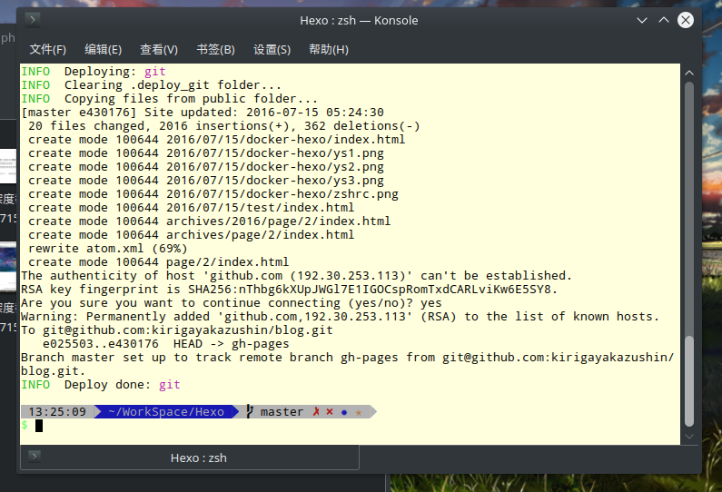

引用一下基友的话
>最开始接触 Hexo 的时候是在 Windows 下, 安装过程还算顺利, 因此在初期还整理了6篇关于 Hexo 博客的搭建教程.

>后来转投 Linux 大法, 期间重装电脑无数次, 每一次安装 Hexo 所需要的 nodejs, 和各种插件的时候都是闹心的过程, 玩的多了自然就熟了, Linux 下的安装基本没问题了.

<!--more-->

>然后入职公司, 公司配了 Mac Pro 又需要安装 Nodejs, 以及各种插件, 人傻搞不定啊.., 晚上迷迷糊糊的还 rm -rf /usr/bin 了.., 所以决定放弃在实体机安装 Nodejs 的想法转战到了 Docker.

>来自mashiro.io

他后来更新了一下dockerfile，他觉得以前的思路是错的，现在他要把hexo封装进docker当做工具，又写了几个alias。
安装docker，然后pull镜像

    docker pull kirigayakazushin/docker-hexo

pull镜像以后，写入alias，将docker-hexo当做本地工具。

    alias hexo='docker run -it --rm -p 4000:4000 -v $PWD:/Hexo -v $HOME/.gitconfig:/home/docker/.gitconfig -v $HOME/.ssh:/home/docker/.ssh kirigayakazushin/docker-hexo hexo'

    alias npm='docker run -it --rm -v $PWD:/Hexo kirigayakazushin/docker-hexo npm'

    alias ddnone="docker images | grep none | awk '{print \$3}' |xargs docker rmi"

然后执行一下命令

    npm install hexo-generator-sitemap --save \
    && npm install hexo-generator-feed --save \
    && npm install hexo-deployer-git --save

把以上内容写进rc文件，我是用zsh的，所以写入~/.zshrc。

接下来基本演示一下使用方式。

