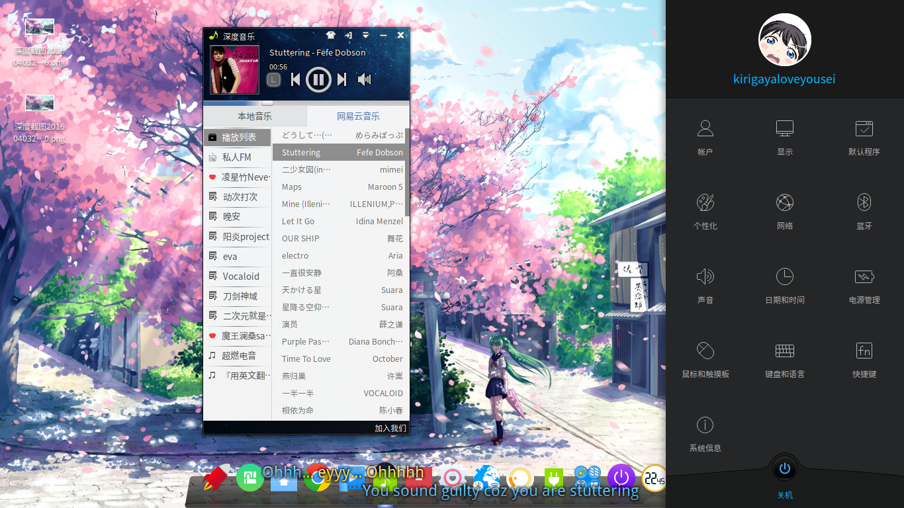

这是我用markdown写的第一篇文章(水文)，先来个自我介绍吧，我是小竹，对没错，是小竹，不是竹子，不是竹酱，更不是竹基。

<!--more-->

我玩linux应该有五六年了吧，初二的时候接触的，不过很多年都保持在换各种发行版上，并没有真正意义的玩。上了大学以后，接触的更多了，玩的也更嗨了。
现在也用上arch+btrfs+uefi了，各种叼炸天。
irc里面也经常学习【看别人装逼。
依旧是英语渣渣，数学渣渣，看到win32api，我直接放弃win编程了，我的智商也就玩玩wpf了。
下面就贴几张我的日常截图。
<!-- more -->
**My Computer info**
<pre><code>
kirigayaloveyousei@linuser
OS: Arch Linux
Kernel: x86_64 Linux 4.4.5-1-ARCH
ackages: 1092
Shell: zsh 5.2
Resolution: 1366x768
WM: Mutter(DeepinGala)
WM Theme: Adwaita
GTK Theme: Arc-OSX [GTK2/3]
Icon Theme: deepin
Font: Noto Sans CJK SC Regular 10
CPU: Intel Core i5-4210U CPU @ 2.7GHz
RAM: 1980MiB / 3861MiB
</code></pre>

