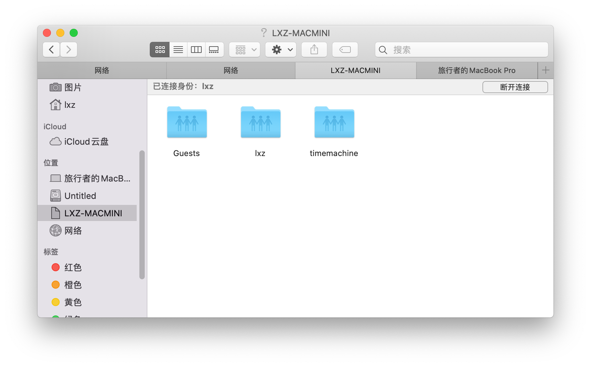
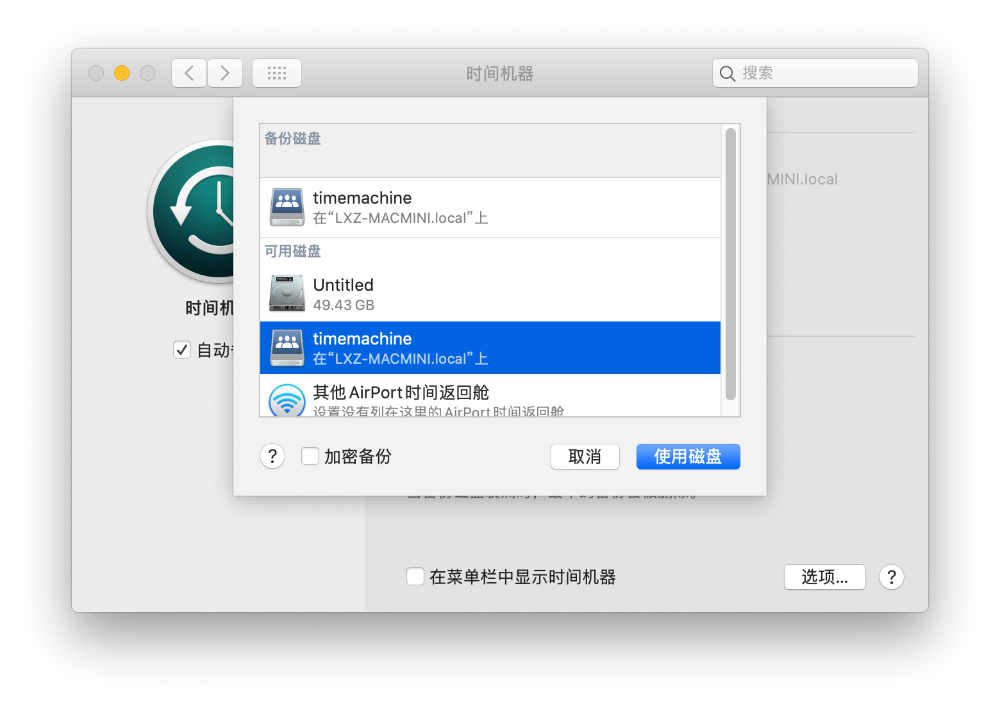
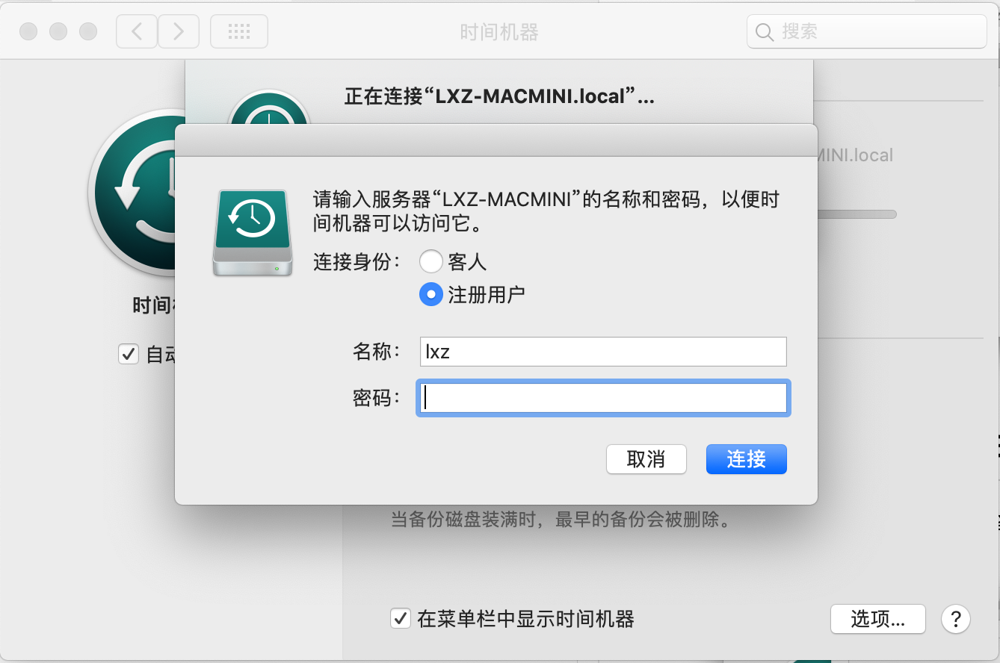
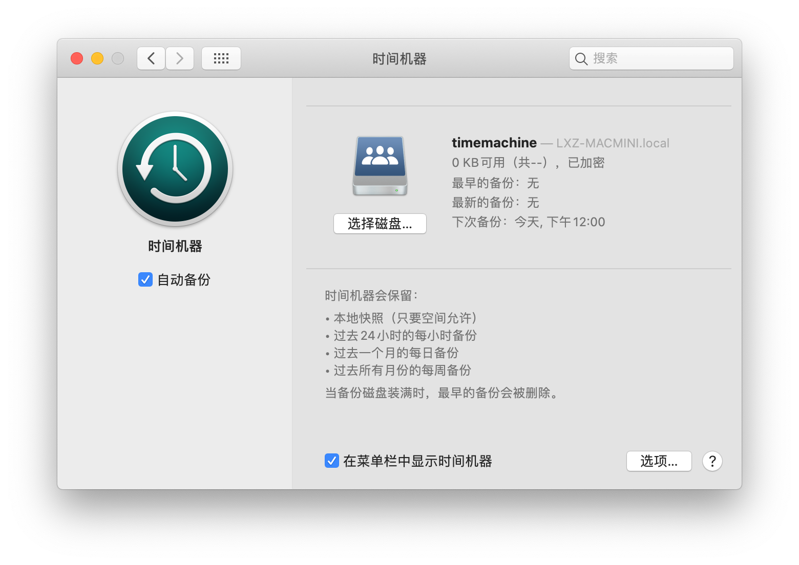

接着上篇的 [samba](/samba)，我给家里配置了 samba 服务器，为家里提供共享存储服务。

我在我笔记本上安装了黑苹果，所以也想顺便试试传说中的 `Time Machine` 自动备份，说不定还能整一套给 deepin 使用呢。

话不多说开干。

# 安装 avahi

Avahi 是一种免费的零配置网络实现，包括用于多播 DNS / DNS-SD服务发现的系统。它可以帮助我们广播 samba 服务器，这样网络内其他机器就可以查找到 samba 服务器了。

在 arch 上安装 avahi。

```shell
pacman -S avahi
```

我们并不需要配置什么，直接开启服务就行了。

```shell
systemctl enable --now avahi-daemon
```

# 配置 samba

我们还需要稍微配置一下 samba 服务，专门开辟一个用于备份的目录。

修改 `/etc/samba/smb.conf`，添加一个 timemachine 的条目。

```text
[timemachine]
    comment = macos time machine backup
    path = /home/lxz/TimeMachine
    valid users = lxz
    browseable = yes
    writeable = yes
    writelist = lxz
    create mask = 0777
    # 加载模块以支持AAPL拓展，注意顺序很重要！
    vfs objects = catia fruit streams_xattr
    # 支持aapl
    fruit:aapl = yes
    # 存储os x的元数据
    fruit:metadata = stream
    # 设置服务器在finder中的图标
    fruit:model = MacPro
    # 支持time machine，非常重要！
    fruit:time machine = yes
    # 文件清理的一些配置
    fruit:posix_rename = yes
    fruit:veto_appledouble = no
    fruit:wipe_intentionally_left_blank_rfork = yes
    fruit:delete_empty_adfiles = yes
```

还需要设置 smb 协议的版本和开启苹果的支持，在配置文件中查找或者添加新的，注意，这里的配置文件必须是在上面条目的上方，我推荐是放在 `dns proxy` 的下方。

```text
min protocol = SMB2
ea support = yes
```

然后我们重启一下 samba 和 avahi的服务。

此时 TimeMachine 和 Finder 都会显示 samba 服务器了。



# 开启 time machine

打开设置，进入时间机器，打开选择一个硬盘。



选择共享的timemachine，点击使用硬盘，然后会弹出来认证的对话框，输入用户名和密码即可。





配置就算完成了，只需要等待自动备份，或者选择下面的在菜单栏中显示时间机器，在菜单栏里选择立即备份。
