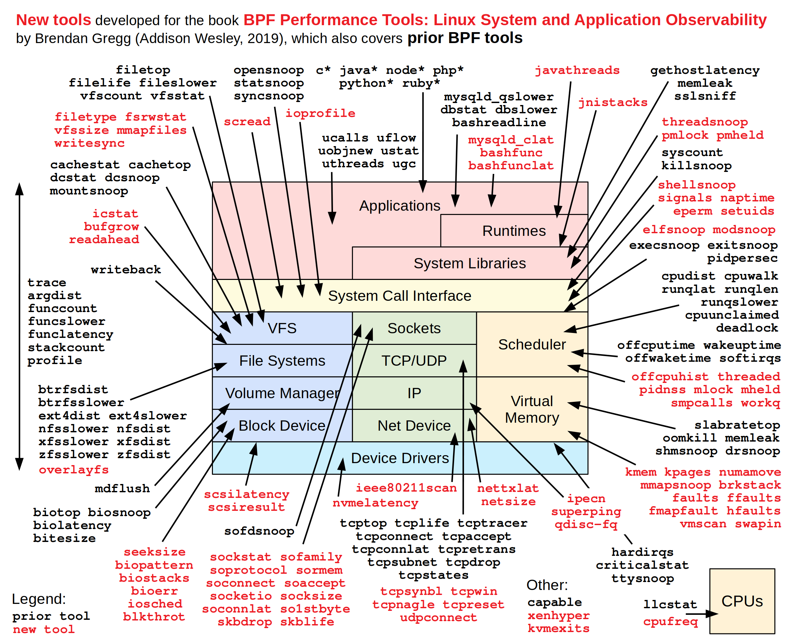

最近在对DDE进行性能优化，所以补习了一下linux下的各种分析工具的使用方法。



这张图是来自Brendan Gregg大佬提供的linux分析工具的应用场景，可以看出几乎包含了系统每个地方应该用什么工具去分析。

<!-- more -->

## Linux Perf Tool

### 允许系统进行分析

为了能够正常分析，首先需要打开系统的调试功能，允许我们去对其他进程进行访问。

### SysCtl

较新的Linux内核具有sysfs可调参数`/proc/sys/kernel/perf_event_paranoid`，该参数允许用户调整perf_events非root用户的可用功能，数量越大则越安全（相应地提供较少的功能）：

```
Consider tweaking /proc/sys/kernel/perf_event_paranoid:
 -1 - Not paranoid at all
  0 - Disallow raw tracepoint access for unpriv
  1 - Disallow cpu events for unpriv
  2 - Disallow kernel profiling for unpriv
```

默认值是不允许获取任何信息，所以我们需要修改为1或者0，允许我们访问CPU的事件信息。

- 临时修改

执行命令向内核接口直接写入值。

```
sudo tee /proc/sys/kernel/perf_event_paranoid <<< 1
```

- 永久修改

使用sysctl来配置其值，创建`/etc/sysctl.d/50_perf_event_paranoid.conf`文件，并写入`kernel.perf_event_paranoid=1`，执行`sysctl -p`来刷新系统配置。

### perf 采样

> 性能优化相关的三种类型的工具，一种是sampling类型的，即采样，这种工具就是不停“询问”程序在做什么，perf在我们使用的这种模式下就是 sampling模式，如果是追踪某些event，就工作在trace模式，实际上就是第二种类型的工具，这种工具主要依靠事件或者hook，程序在运行的过程中不停主动告诉工具它自己在做什么，比如 strace；第三种是 instrument 类型的，这种主要就是依赖编译器进行插桩，精确知道代码行级别的执行情况（参考gcc instrumentation ）。
>
> by hualet on [deepin 15.7](https://docsin.uniontech.com/?p=735)

我们通过perf record命令才对程序进行采样记录。

```
perf record -g --call-graph=dwarf -F 99 /usr/bin/dde-shutdown
```

命令介绍：

```
-g: 即采样全部信息
--call-graph: 设置并启用调用图（堆栈链/回溯）记录，参数有fp(frame pointers)、dwarf(debug information)和lbr(Last Branch Record)。
-F: 采样率
```

perf可以直接启动一个程序进行分析，也可以使用-p参数指定一个pid进行采样。

### 查看 perf 的采样结果

当我们通过perf record完成采样以后，会在执行目录生成perf.data文件，此时我们就可以使用perf report命令对data文件进行数据分析了。

```
perf report --stdio
```

perf report会自动打开当前目录下的perf.data文件，当然也可以在最后指定perf.data文件的路径。

perf report会根据--call-graph参数来生成不同的图，使用dwarf参数时会以函数调用栈的顺序来显示，使用这种方式可以方便的看出哪个函数执行的时间比较长，因为每次采样都能落到该函数上，也就意味着函数执行的时间非常长，再通过调用栈的深度来分析函数执行期间都在做什么事情。

### hotspot火焰图

在命令行下查看函数调用不是特别方便，所以就有图形化的工具用来方便的查看perf工具的生成结果，其中使用比较友好的是kde开发的hotspot工具，该工具可以直接打开perf.data文件，并生成对应的火焰图，火焰图是函数调用的另一种表现形式，火焰越高，也就意味着调用栈越深，火焰越广，也就意味着函数执行的时间很长。
