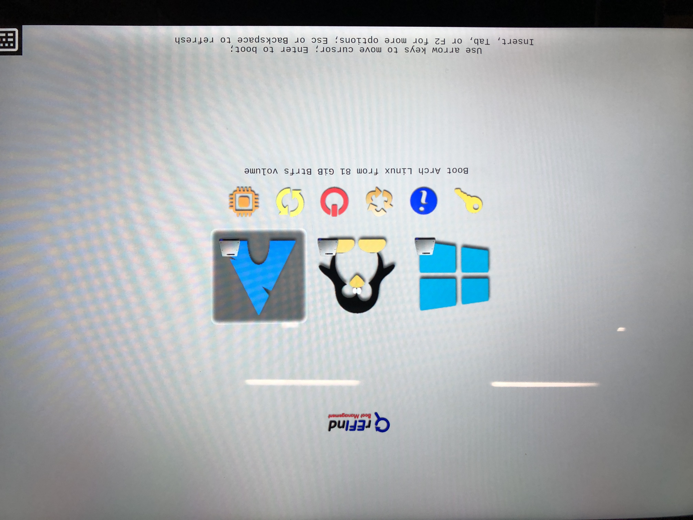

今年的七夕，我老婆给我买了一台surface laptop 2代，8G内存 + 256G存储版本，我也成功的用上了田牌的机器。

<!-- more -->

> 2020/09/17更新： 不知道为啥，反正是开了对内核签名以后，哪怕是BIOS关闭了安全启动，仍然出现mkinitcpio会卡在autodetect上，无奈全部都删掉重来了，没有弄签名，希望各位看到本文章以后解决了这个问题能回复一下，谢谢。

surface默认是开启了安全启动(Microsoft签名)和bitlocker来保障设备和系统安全，我作为一个linux系统的开发者，当然是需要在surface上装一个linux了，但是前两年zccrs已经踩过坑了，linux不识别surface键盘，同样的触摸、网卡、声卡等设备也工作的不是很正常，本来以为我要开启远程开发的生活了，还特意写了一篇[《使用VSCode远程开发DDE》](https://blog.justforlxz.com/2020/09/03/use-vscode-to-remotely-develop-dde/)，来给公司里有同样烦恼的人，让他们也感受一下远程开发的魅力。

苍天不负有心人，我成功的！

我成功的使用上了ArchLinux,并且工作的十分良好。这多亏了github上的一个组织[linux-surface](https://github.com/linux-surface/linux-surface/)，有这么一些人，他们付出劳动来让手里的surface设备也用上linux,并且要和普通的x86兼容机一样工作，感谢他们的付出，也让我吃上了螃蟹，安装的过程我就不在这里详细说了，其实非常简单。

首先因为surface只有一个usb口，而键盘并不能工作，所以需要一个usb的扩展器。先按fn+f6进bios关闭掉安全启动，修改引导顺序为usb优先，之后就是正常的安装系统，但是不需要安装仓库里的内核，我们需要安装linux-surface提供的仓库里的内核。

这些都是非常正常的步骤，linux-surface提供了自己的仓库和内核，我们正常使用即可。

这里开始就是我研究了半天的内容， **开启安全模式!**

首先我看了一下arch wiki上有关于安全启动的内容，写的挺详细的，就是看不懂。讲了各种的知识点，各种签名的方式，但是真正到我开始用的时候，我是一直失败的，失败的方式我就不说了，直接说我如何成功的。

首先我放弃了grub,一个原因是grub的安全启动我一直没有尝试成功，另外一个是我只有一个系统，没必要用grub。我换成了rEFInd来作为我的bootloader，首先安装rEFInd的引导。

```
yay -S refind shim-signed sbsigntools
```

```
sudo refind-install --shim /usr/share/shim-signed/shimx64.efi --localkeys
```

来解释一下上面两条明令。第一个是安装必要的软件包，refind是bootloader本体，shim-signed是aur里面的用于安全启动的包，shim提供了一种并行的安全启动验证功能，我们使用它来启动refind的efi,再通过refind的efi启动内核，达到终极套娃启动。sbsigntools是用于给文件签名的工具，我们安装完refind以后，refind会帮助我们生成一份默认的key,我们需要使用这个key来为内核进行签名。

在执行第二条明令以后，会有几次询问，都选择Y回车就行。

然后使用sbsigntools来对内核进行签名。

```
sudo sbsign --key /etc/refind.d/keys/refind_local.key --cert /etc/refind.d/keys/refind_local.crt --output /boot/vmlinuz-linux-surface /boot/vmlinuz-linux-surface
```

准备工作已经进行一半了，我们只需要写一下refind的配置文件，就可以启动了。

refind的配置文件有两个地方，一个是boot分区下面的refind_linux.conf，还有一个是在efi分区里的EFI/refind/refind.conf，我们需要修改的是后者。

默认配置文件都是注释的，其实我们全部删了就可以了，有需要修改的地方去看原始文件或者文档就行了。

添加一个menuentry，就可以启动系统了。

```
also_scan_dirs +,ArchFS/boot
dont_scan_dirs ESP:/EFI/boot,EFI/boot
dont_scan_files shim.efi,MokManager.efi,fbx64.efi,mmx64.efi,shimx64.efi
scan_all_linux_kernels false

menuentry "Arch Linux" {
    icon     /EFI/refind/icons/os_arch.png
    volume   8B131F77-62D7-4B4A-82D4-B60D7ACA2F6C
    loader   /ArchFS/boot/vmlinuz-linux-surface
    initrd   /ArchFS/boot/intel-ucode.img
    initrd   /ArchFS/boot/initramfs-linux-surface.img
    options  "root=UUID=9f8f9556-8ec1-4feb-9519-435beac8376f rw rootflags=subvol=ArchFS  loglevel=3 quiet add_efi_memmap"
    submenuentry "Boot using fallback initramfs" {
        initrd /ArchFS/boot/initramfs-linux-surface-fallback.img
    }
    submenuentry "Boot to terminal" {
        add_options "systemd.unit=multi-user.target"
    }
}
```

我用的是btrfs文件系统，所以配置文件有点罗嗦。解释一下上面的内容。

also_scan_dirs是指定扫描某个目录，因为我是btrfs文件系统，必须使用这个才能让refind扫描到内核文件，否则会无法启动。

dont_scan_dirs是跳过指定的目录，因为refind默认是会扫描所有的efi文件，我们自己提供了emnuentry,所以不需要让它扫描了。

dont_scan_files是跳过指定的文件，这里是防止其他目录出现对应的efi也被扫描到。

scan_all_linux_kernels是扫描所有linux内核，这样所有的内核就会出现在启动列表里，我们同样也是不需要的。

menuentry里面需要修改的地方有，volume是分区的partuuid,我因为这个uuid就测试了好几次，最后才反应过来不是filesystem uuid,要求的是partition uuid. 所有遇到ArchFS的地方都是不需要的，因为btrfs支持字卷，我的系统是在一个叫ArchFS的卷里面的，如果不是btrfs的文件系统，这个是不需要的，同样options里的rootflags选项也是不需要的，这是传递给内核的参数，让内核可以正确的加载根分区。

这样就算完工了，重启系统，然后进bios里把安全启动改成Microsoft & 3rd party CA，然后重新启动。

当第一次加载rEFInd的时候，因为我们的证书是才生成的，主板并没有存储对应的签名，rEFInd会启动mmx64.efi来让我们加载证书，证书的位置在`/etc/refind.d/keys`下，选择`refind_local.cer`导入，然后选择重启，重新进入系统就可以了。

导入证书这部分我其实不太确定，因为我除了使用shim方案，我还测试了preloader方案，那个方案会一开始就启动一个MOK的工具进行证书导入，我记不太清shim到底需不需要手动导入了，如果出现了，那就导入一下就行了，没出现的话就能正常的看到引导界面和进入系统了。

还有一个后续的动作需要处理，就是内核升级以后，我们需要对内核重新签名，否则会被bios拒绝启动。

编辑`/etc/pacman.d/hooks/99-secureboot.hook`,并写入以下配置：

```
[Trigger]
Operation = Install
Operation = Upgrade
Type = Package
Target = linux
Target = linux-surface
Target = systemd

[Action]
Description = Signing Kernel for SecureBoot
When = PostTransaction
Exec = /usr/bin/sh -c "/usr/bin/find /boot/ -type f \( -name 'vmlinuz-*' -o -name 'systemd*' \) -exec /usr/bin/sh -c 'if ! /usr/bin/sbverify --list {} 2>/dev/null | /usr/bin/grep -q \"signature certificates\"; then /usr/bin/sbsign --key /etc/refind.d/keys/refind_local.key --cert /etc/refind.d/keys/refind_local.crt --output {} {}; fi' \;"
Depends = sbsigntools
Depends = findutils
Depends = grep
```

享受安全启动吧～



