本文将介绍如何使用VSCode的远程开发套件连接到Deepin主机，进行DDE和其他软件的开发与调试.

<!-- more -->

## 介绍

Visual Studio Code（简称VS Code）是一个由微软开发，同时支持Windows 、 Linux和macOS等操作系统的免费代码编辑器，它支持测试，并内置了Git 版本控制功能，同时也具有开发环境功能，例如代码补全（类似于 IntelliSense）、代码片段和代码重构等。该编辑器支持用户个性化配置，例如改变主题颜色、键盘快捷方式等各种属性和参数，同时还在编辑器中内置了扩展程序管理的功能。

在VSCode出来之前，Sublime曾经是前端开发者必备的软件，它使用python作为插件运行环境，并且也拥有不少的插件，但是很遗憾的是插件不能更改界面元素，可玩性不是很高。

再后来Atom作为GitHub的顶梁柱出现了，它基于使用Chromium和Node.js的跨平台应用框架Electron（最初名为Atom Shell），并使用CoffeeScript和Less撰写，并且支持js开发的插件，一时间拥有非常多的用户，并且从Sublime那里拉拢了非常多的前端开发者。

但是一切都在VSCode面世以后变了。VSCode同样也是基于Chromim和Electron开发，并且支持TypeScript开发插件，而且启动速度比Atom快很多，而且作为微软面向开源社区的主力产品，它和TypeScript一样，吸收了社区的很多意见和贡献，使得软件越来越好用。在语言支持方面，对 C#、JavaScript、和 TypeScript 等编程语言的原生支持最为完善。

## 安装VS Code

官网提供的有vscode的安装包，windows用户下载stable版本的exe(System Installer)。

System Installer可以自动下载对应语言的环境包，推荐安装此版本。

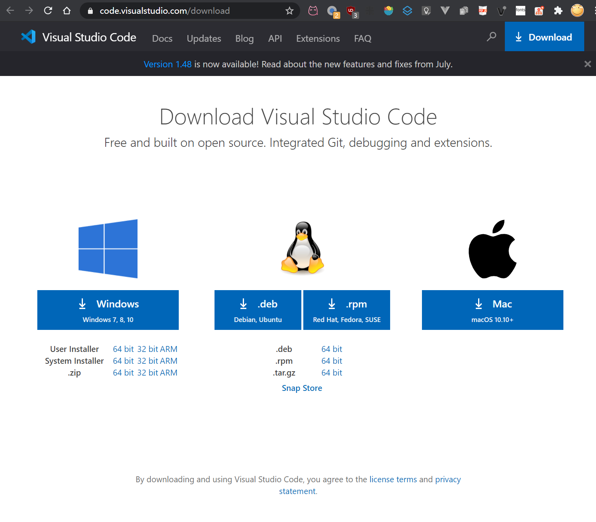

安装完成后就可以安装插件了。

## 安装插件

插件系统是一个编辑器的左膀右臂，emacs和vim作为终端下开发经常使用的编辑器，就拥有非常丰富的插件，几乎每个大佬使用的emacs和vim都不能互换使用。

dde的项目几乎都是cmake的项目，所以需要安装cmake插件和c++的插件，安装了这两个插件以后。vscode打开项目工程就会自动解析CMakeLists.txt，并且开启vscode的快速调试功能，还可以开始构建项目和调试项目了。

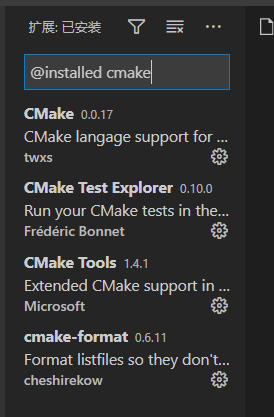

安装CMake、CMake Tools这两个插件就可以开发了。

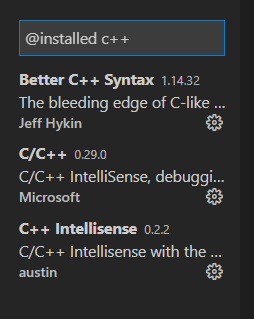

安装C/C++和C++ Intellisense这两个插件可以对项目中的c++代码进行智能感知和代码补全，推荐安装。

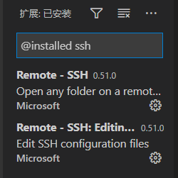

安装Remote - SSH插件，可以让vscode通过ssh连接到目标机器，打开远程机器的目录和文件，并且在该模式下，部分插件可以自动切换成本地/远程模式，这样就可以在本机直接开发，但是操作的内容都是远程环境的。

安装完Remote - SSH插件以后，vscode的左下角就会有一个绿色的按钮，可以用来切换模式。

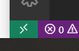

## 配置远程环境

因为是要在Windows上进行远程开发，如果是直接在UOS或者Deepin上开发DDE，这一部分是可以不用看的，上面的插件安装完成以后就可以开发项目了。

点击左下角的绿色按钮，在弹出的面板选择Remote-SSH: Connect to Host。

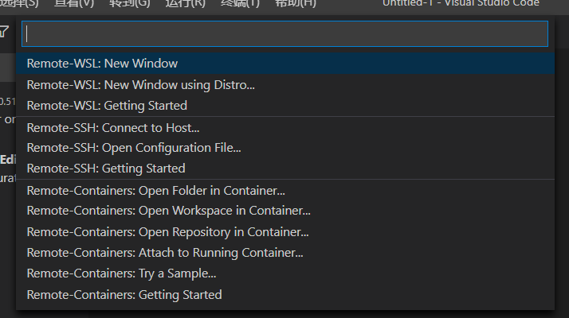

会继续弹出一个面板，用来选择配置ssh的连接。

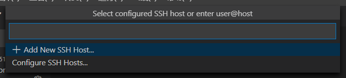

选择Add New SSH Host添加一个服务器。

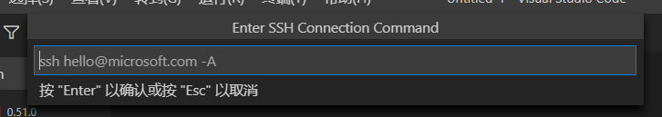

输入ssh的命令，例如 ssh lxz@10.20.32.54。

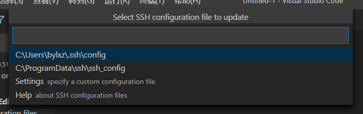

然后选择一个保存配置的位置，一般默认选择用户家目录的.ssh目录即可。然后就提示添加成功，此时可以点击Connect按钮进行连接。

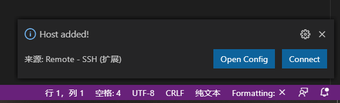

输入密码

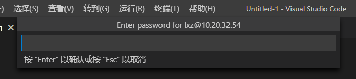

登录以后会打开一个新的窗口，并提示正在连接。连接成功以后可以在左下角看到机器的信息。


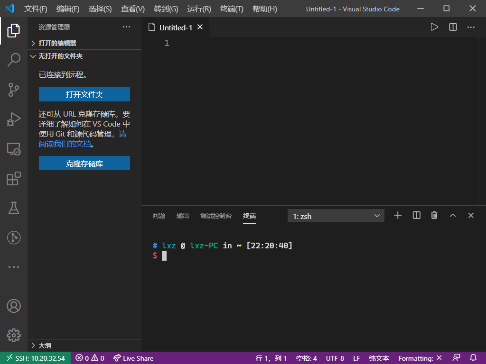

然后打开命令面板，选择在SSH中安装本地扩展。

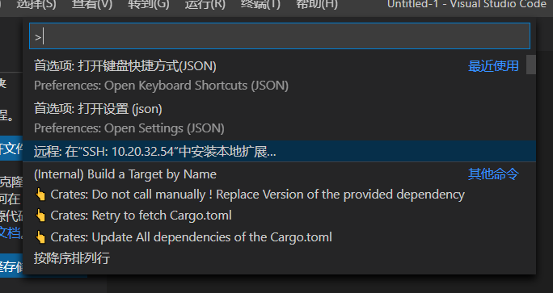

在打开的列表选择全选，然后安装。

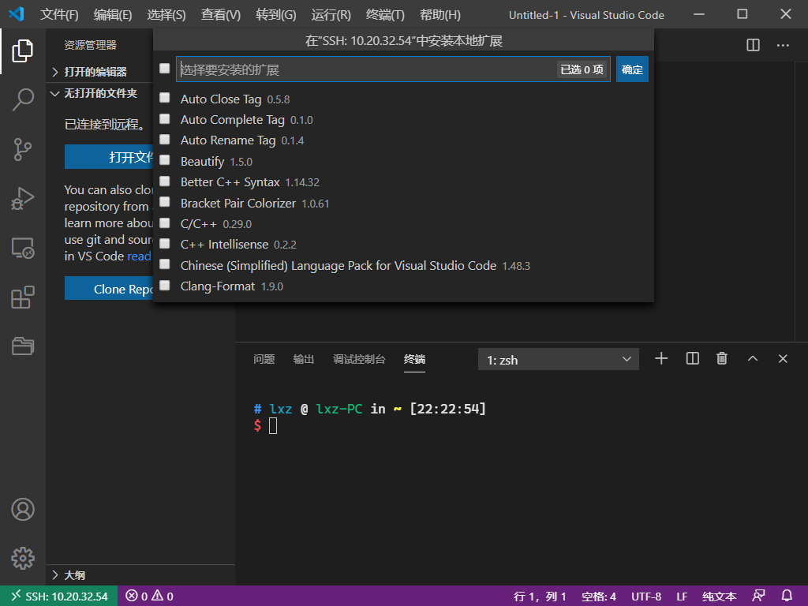

等待全部安装成功。

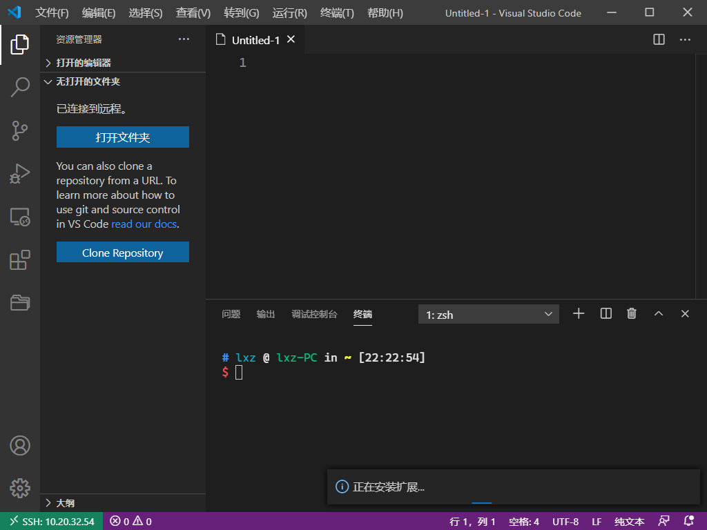

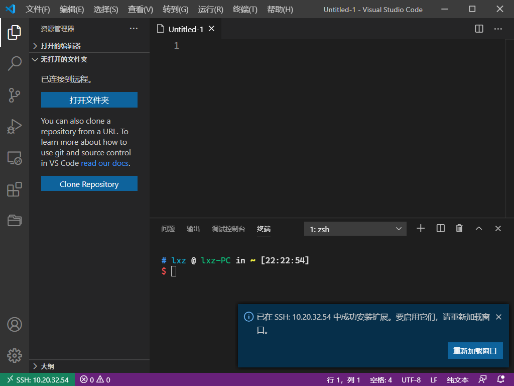

## 开发和调试

### 功能介绍

CMake插件提供了编译、运行和调试的功能和命令，可以点击下方面板中的select target，选择要运行的目标程序，选择切换编译模式，可以选择Debug或者Release。还可以选择使用哪个编译器进行构建。

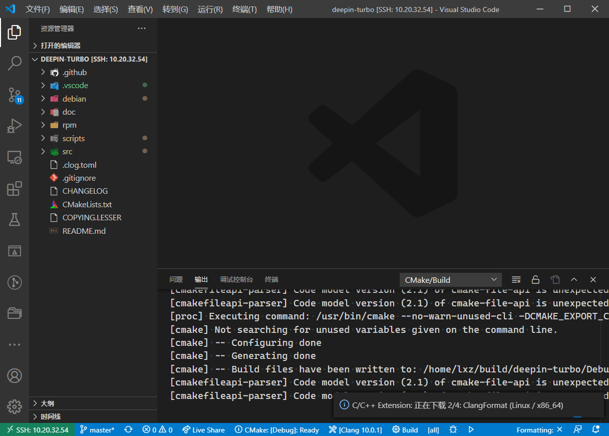

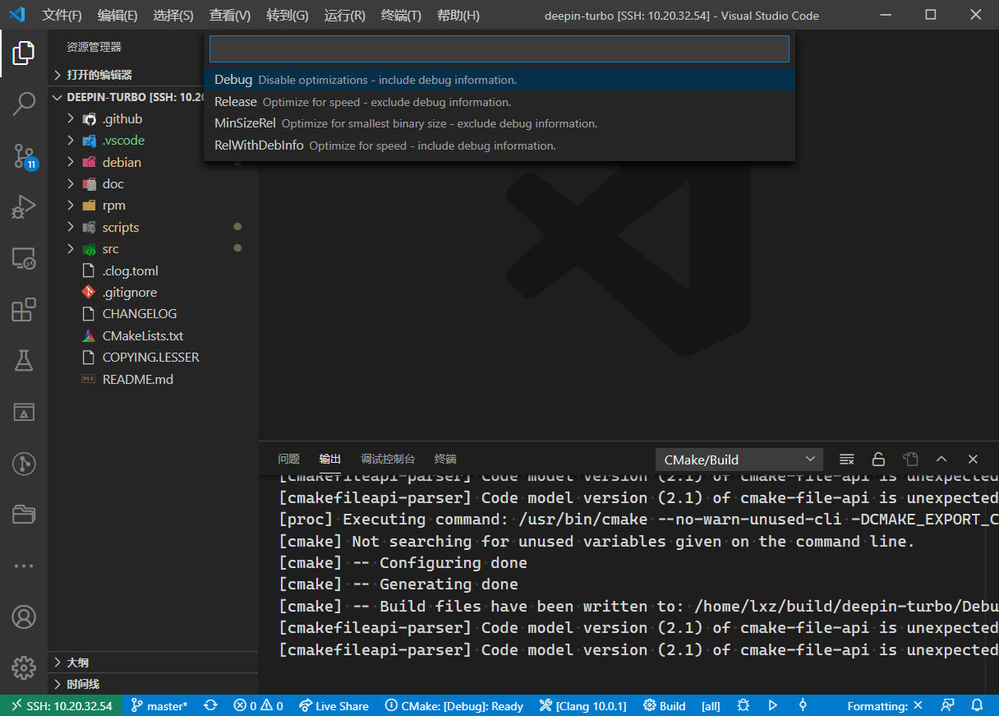

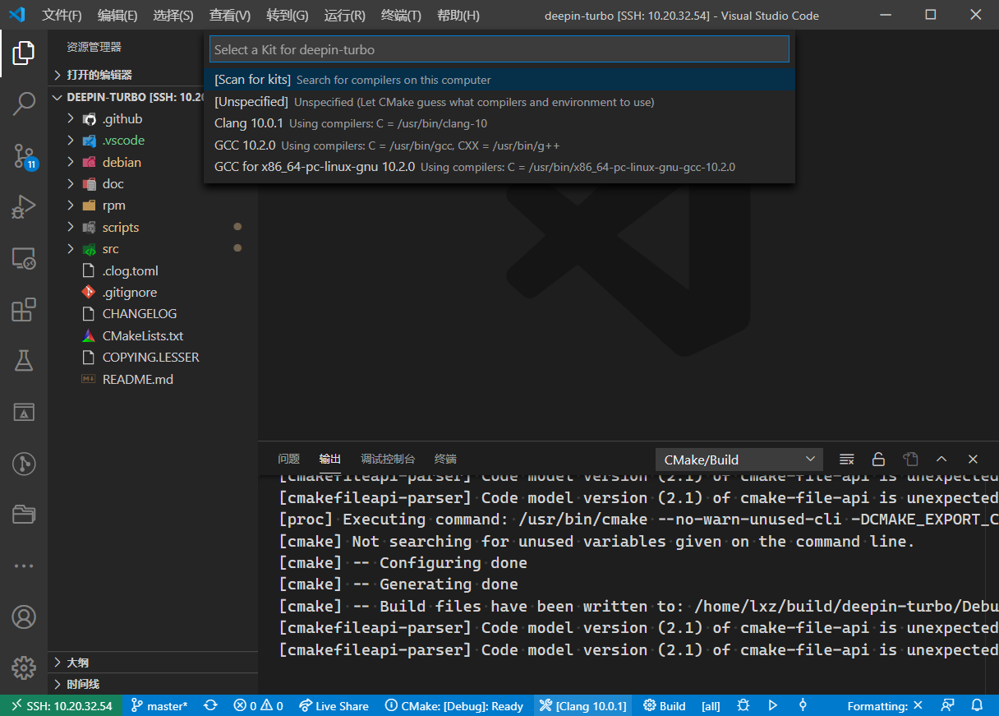

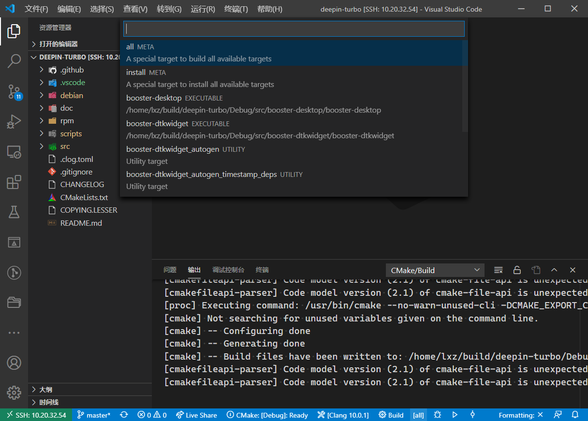

### 设置启动参数

如果程序启动不需要提供参数，则可以直接点击下方面板的Debug按钮，或者打开命令面板选择CMake Debug Target，如果没有选择过Target，则会询问一次设置Target。

点击左侧的调试按钮，选择添加配置。

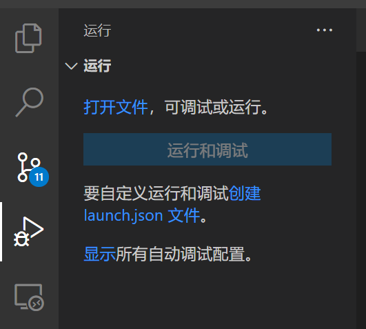

在弹出的面板选择GDB

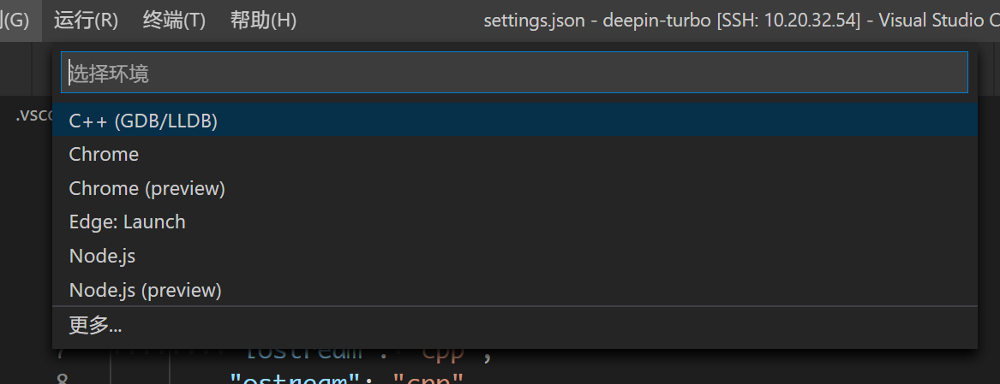

此时vscode会创建出一个json文件，并生成了默认的配置文件。


我们需要进行一些调整，以便使用该配置文件进行调试。

program字段是程序二进制文件的位置，一般情况下我们是要手动写好路径，但是如果项目的二进制特别多，更换配置文件就会非常麻烦，而且配置文件里写死路径也不是很方便，我查阅了CMake插件的文档，发现CMake插件提供了两个很重要的变量，可以让我们方便的查找到路径。

```json
"program": "${command:cmake.launchTargetPath}"
```

CMake插件提供了launchTargetPath的变量，它对应的是CMake插件选择的默认target，启动调试之前需要我们先选择好Target。

```plain
"value": "$PATH:${command:cmake.launchTargetDirectory}"
```

CMake插件还提供了launchTargetDirectory变量，用于获取程序启动所在的目录，一般需要我们指定到本次调试所需的环境变量中。

```plain
"environment": [
  {
    "name": "PATH",
    "value": "$PATH:${command:cmake.launchTargetDirectory}"
  },
]
```

然后我们就可以添加启动参数了。
args字段保存了程序启动会传递的参数列表，例如这里会给fuse传递-d和/tmp/x。

```plain
"args": [
  "-d",
  "/tmp/x"
]
```

完整的配置如下：

```json
{
    "name": "(gdb) fuse",
    "type": "cppdbg",
    "request": "launch",
    "program": "${command:cmake.launchTargetPath}",
    "args": [
        "-d",
        "/tmp/x"
    ],
    "stopAtEntry": false,
    "cwd": "${workspaceFolder}",
    "environment": [
        {
            "name": "PATH",
            "value": "$PATH:${command:cmake.launchTargetDirectory}"
        },
    ],
    "externalConsole": false,
    "MIMode": "gdb",
    "setupCommands": [
        {
            "description": "为 gdb 启用整齐打印",
            "text": "-enable-pretty-printing",
            "ignoreFailures": true
        }
    ]
}
```

### gdb调试

此时我们就可以先通过CMake插件构建整个项目，再切换到运行面板，启动调试。

点击下方面板的Build按钮，构建项目。

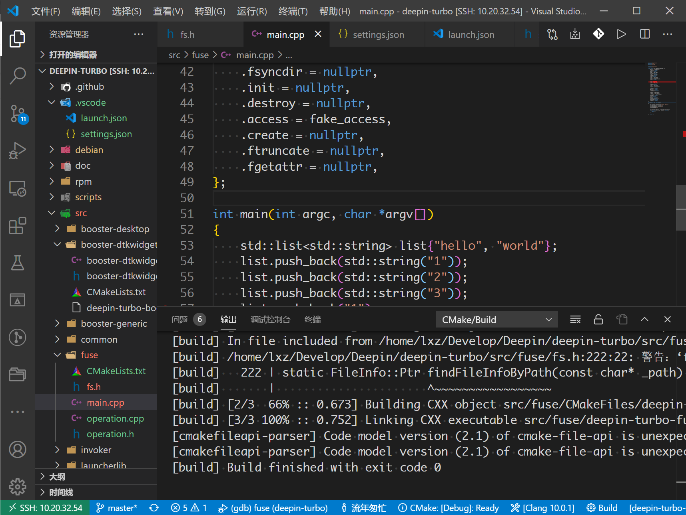

再点击左侧的gdb fuse(deepin-turbo)按钮，因为配置文件里面我们起的名字是gdb fuse。我们在main函数添加一个断点，用来测试gdb是否工作正常。

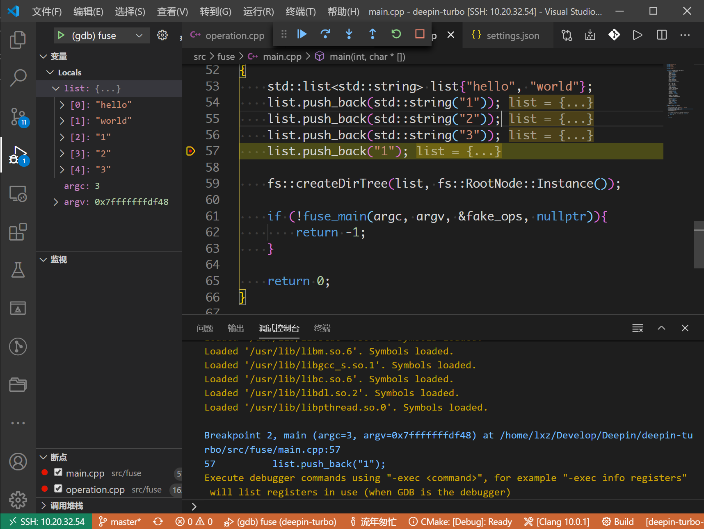

一切都工作正常，在调试控制台可以使用-exec作为前缀来执行gdb的命令。

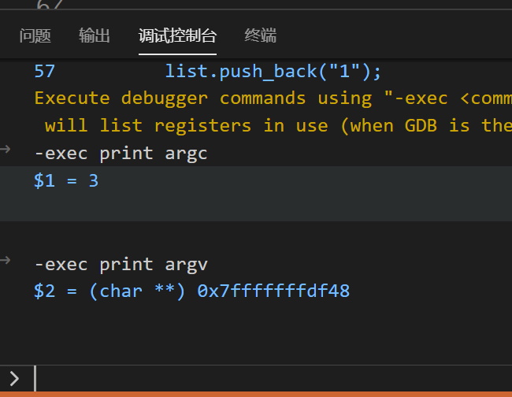

### 调试图形程序

调试图形程序稍微有一些麻烦，因为是远程开发，图形程序又只能工作在目标机器，这里提供两个可行的方案。

1. synergy之类的键盘鼠标共享软件
2. 在windows安装xserver

第一种方案是通过共享本机的键盘鼠标到远程机器，这样就可以在远程环境上面进行直接操作，好处是除了调试，也可以同时操作远程机器进行使用。

第二种方案是利用X11协议的网络透明，既图形程序和显示服务不一定在同一台机器上运行，我们只需要在Windows安装XServer程序，就可以让远程机器上的程序的画面显示到当前机器，并且可以操作。但是此方案有缺点，虽然设计上这种分离结构设计的很巧妙，但是因为远程OpenGL调用并不支持，所以图形无法调用3D程序渲染，并且和远程机器沟通需要大量的带宽，所以用起来体验并不好。

为了使用这两种方案，我们都需要在调试的launch.json中添加一个环境变量。

在运行面板点击齿轮按钮，可以编辑当前方案。

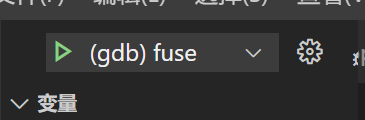

在打开的json文件中，找到environment字段，添加DISPLAY环境变量。

```plain
"environment": [
  {
    "name": "DISPLAY",
    "value": ":0"
  }
]
```
这样程序启动就有DISPLAY环境变量，我们就可以让程序在目标机器的屏幕上运行了。
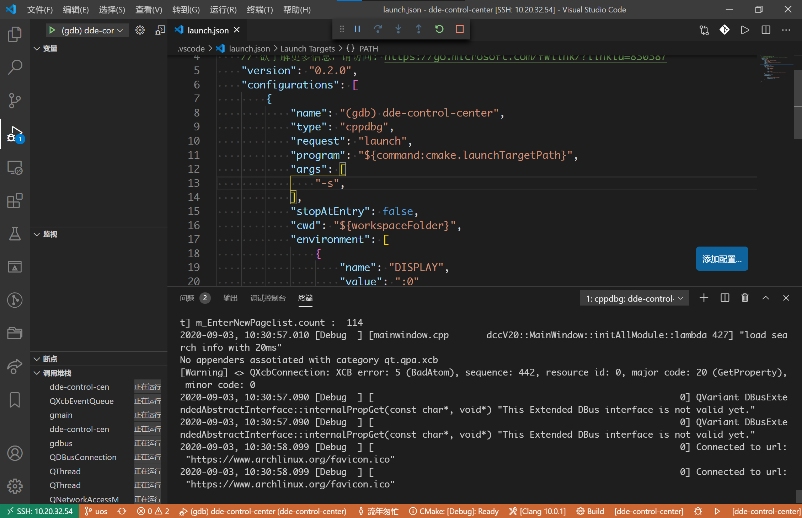


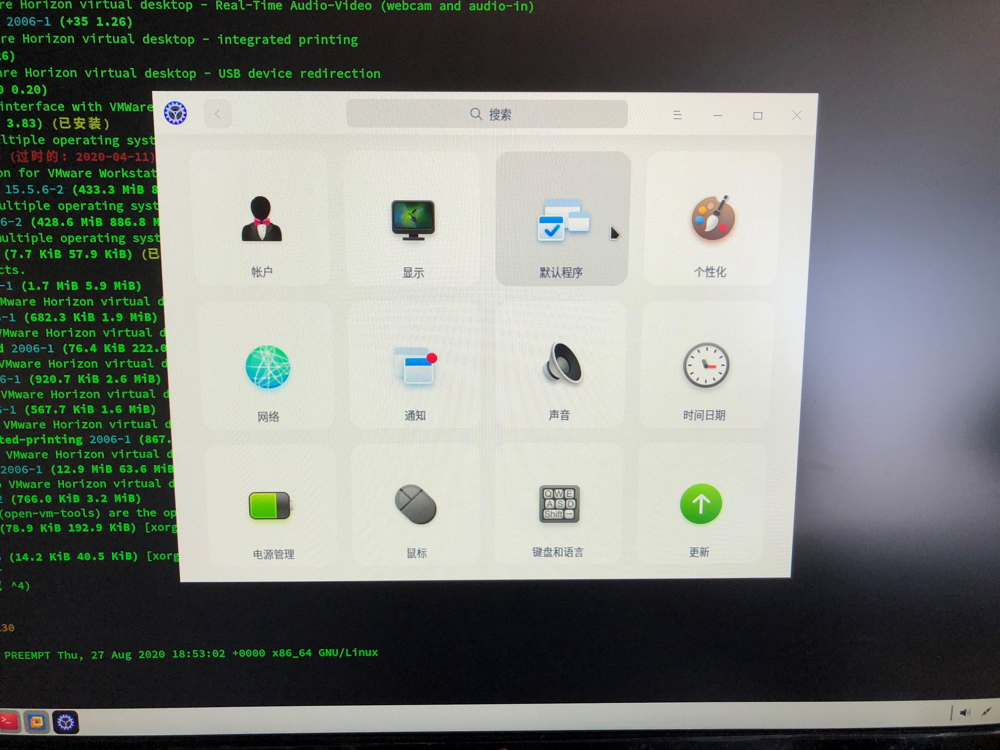

还有一种自动化测试的方案，该方案是我个人认为所有开发都应该掌握的，通过自动化测试，我们就可以完全使用远程开发来完成开发任务，调试的时候只需要等待自动测试结果返回即可，设想一下，某个模块需要点击很多地方才可以重现一个问题，我们只需要设置好断点，让程序自动开始执行所有函数，并在最终出现问题的地方停下，我们就可以开始手动单步跟踪问题，完全不需要使用鼠标人工点击。（然而理想很美好，现实很残酷，我个人目前都没有掌握自动化测试的方式，现在也是只能通过鼠标点点点来重现问题。
