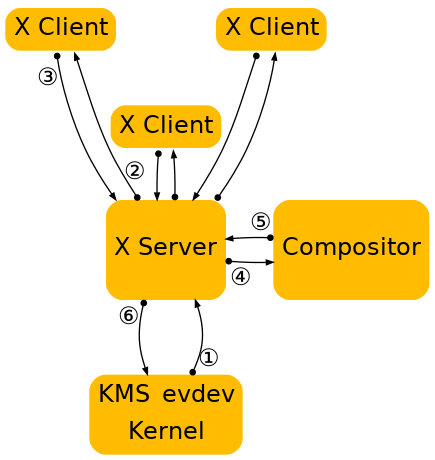
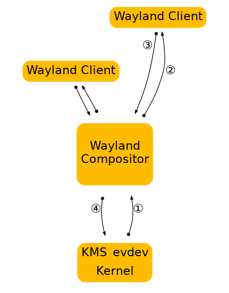

## 第三章. Wayland 体系结构

### X 和 Wayland 的体系结构对比

了解 Wayland 架构以及它与 X 有何不同的好方法是关注从输入设备到它影响的更改出现在屏幕上的事件。

这是 X 目前的情况：

图 3.1 X 架构图

1. 内核从输入设备获取事件，并通过 evdev 输入驱动程序将其发送到 X。内核通过驱动设备并将不同的设备特定事件协议转换为 linux evdev 标准输入事件，在这里完成所有艰苦的工作。
2. X 服务器确定事件影响哪个窗口，并将其发送给已选择用于该窗口上有关事件的客户端。X 服务器实际上不知道如何正确地做到这一点，因为屏幕上的窗口位置由合成器控制，并且可能会以 X 服务器无法理解的多种方式进行转换（缩小、旋转、摆动等）。
3. 客户端查看事件并决定该怎么做。通常，UI 必须根据事件进行更改，也许点击了复选框或显示的按钮。因此，客户端将渲染请求发送回 X 服务器。
4. 当 X 服务器收到渲染请求时，它会将其发送给驱动程序，以便对硬件进行编程以进行渲染。X 服务器还计算渲染的边界区域，并将其作为损坏事件发送给合成器。
5. 损坏事件告诉合成器窗口中发生了变化，它必须重新合成窗口可见的那部分屏幕。合成器基于它的场景和X窗口的内容负责渲染整个屏幕的内容。然而，它必须通过X服务器来显示它。
6. X 服务器接收来自合成器的渲染请求，然后将合成器的后缓冲区复制到前缓冲区或进行页面翻转。在一般情况下，X 服务器必须进行此步骤，以便它可以解释重叠的窗口，这可能需要剪切并确定是否可以翻页。然而，对于一个合成器，它总是全屏，这是另一个不必要的上下文切换。

如上所述，这种方法存在一些问题。X 服务器没有信息来决定哪个窗口应该接收事件，也不能将屏幕坐标转换为窗口本地坐标。尽管 X 已将屏幕最终绘画的责任交给了合成器，但 X 仍控制着前缓冲和模式化。用于处理的 X 服务器的大部分复杂性现在可在内核或自包含库中提供（KMS、evdev、mesa、字体配置、自由型、cairo、Qt 等）。一般来说，X 服务器现在只是一个中间人，在应用程序和合成器之间引入额外的步骤，在合成器和硬件之间引入额外的步骤。

在 Wayland ，合成器是显示服务器。我们将 KMS 和 evdev 的控制权移交给合成器。Wayland 协议允许合成器将输入事件直接发送给客户端，并允许客户端将损坏事件直接发送给合成器：

图 3.2 Wayland 架构图

1. 内核获取事件并将其发送给合成器。这与 X 案例类似，这太棒了，因为我们可以重复使用内核中的所有输入驱动程序。
2. 合成器查看其场景图，以确定哪个窗口应该接收该事件。场景图对应于屏幕上的内容，合成器了解它可能应用于场景图中元素的转换。因此，合成器可以通过应用反向转换来选择正确的窗口并将屏幕坐标转换为窗口本地坐标。可应用于窗口的转换类型仅限于合成器可以执行的转换类型，只要它可以反向转换计算输入的事件。
3. 与 X 案例一样，当客户端收到事件时，它会根据响应更新 UI。但在 Wayland 案例中，渲染发生在客户端中，客户只需向撰写商发送请求，以指示已更新的区域。
4. 合成器从客户端收集损坏请求，然后重新组合屏幕。然后，合成器可以直接发出一个 ioctl 来安排与 KMS 的翻页。

### Wayland 渲染

我在上面概述中遗漏的一个细节是客户在 Wayland 下的实际渲染方式。通过从图片中删除 X 服务器，我们还删除了 X 客户端通常呈现的机制。但还有另一种机制，我们已经使用与 DRI2 下 X：直接渲染。通过直接渲染，客户端和服务器共享视频内存缓冲区。客户端链接到渲染库（如 OpenGL），该库知道如何对硬件进行编程并直接渲染到缓冲区。合成器反过来可以取缓冲器，并在它复合桌面时将其用作纹理。初始设置后，客户端只需要告诉合成器使用哪个缓冲器，以及它何时何地向其中呈现了新内容。

这给应用程序留下了两种更新窗口内容的方法：

1. 将新内容渲染为新的缓冲区，并告诉合成器使用该内容而不是旧缓冲区。应用程序可以在每次需要更新窗口内容时分配一个新的缓冲区，或者它可以在它们之间保持两个（或多个）缓冲区并循环。缓冲区管理完全处于应用控制之下。
2. 将新内容渲染到缓冲区中，该缓冲区以前曾告诉合成器使用。虽然可以直接渲染到与合成器共享的缓冲区中，但这可能会与合成器竞争。可能发生的情况是，重新粉刷窗口内容可能会被重新粉刷桌面的合成器中断。如果应用程序在清除窗口后被中断，但在渲染内容之前，合成器将从空白缓冲区进行纹理。结果是应用窗口将在空白窗口或半渲染内容之间闪烁。避免这种情况的传统方法是将新内容渲染为后缓冲区，然后从中复制到合成器表面。后缓冲区可以即时分配，并且足够大，可以容纳新内容，或者应用程序可以保持缓冲区。同样，这处于应用控制之下。

在这两种情况下，应用程序必须告诉合成器表面的哪个区域具有新内容。当应用程序直接呈现到共享缓冲区时，需要注意合成器是否有新内容。但是，在交换缓冲时，合成器不会假设任何更改，并且需要应用程序的请求才能重新粉刷桌面。即使应用程序将新的缓冲区传递给合成器，缓冲区的一小部分也可能不同，如闪烁的光标或微调器。、

### 为Wayland启用硬件

通常，硬件启用包括模式安装/显示和 EGL/GLES2。除此之外，Wayland 还需要一种方法来在流程之间高效共享缓冲区。这有两个方面，客户端和服务器端。

在客户端，我们定义了一个Wayland EGL 平台。在 EGL 模型中，该模型包括原生类型（EGLNative 显示类型、EGLNATIVE 窗口类型和 EGLNativePixmapType）以及创建这些类型的方法。换句话说，它是将 EGL 堆栈及其缓冲共享机制与通用 Wayland API 绑定起来的胶水代码。EGL 堆栈预计将提供 Wayland EGL 平台的实施。完整的 API 位于 wayland-egl.h 头文件中。mesa EGL 堆栈中的开源实现处于 wayland-egl.c 和 platform_wayland.c 状态。

在引擎盖下，EGL 堆栈预计将定义供应商特定的协议扩展，允许客户端 EGL 堆栈与合成器通信缓冲详细信息，以便共享缓冲区。Wayland-egl.h API 的要点是抽象掉它，让客户端为 Wayland 表面创建一个 EGL 表面并开始渲染。开源堆栈使用 drm Wayland 扩展，允许客户端发现 drm 设备用于使用和验证，然后与合成器共享 drm （GEM） 缓冲区。

Wayland 的服务器端是垂直的合成器和核心 UX，通常将任务切换器、应用启动器、锁屏界面集成在一个单一应用程序中。服务器运行在调制 API（内核模式，OpenWF 显示器或类似）的顶部，并使用 EGL/GLES2 合成器和硬件叠加（如果可用）的组合组合将最终的 UI 进行复合。启用模式设置、EGL/GLES2 和叠加应该是标准硬件带来的一部分。Wayland 启用的额外要求是 EGL_WL_bind_wayland_display 扩展，允许合成器从通用 Wayland 共享缓冲区创建 EGLImage。它类似于从 X 像素图创建 EGLIM 的 EGL_KHR_image_pixmap 扩展。

扩展具有设置步骤，您必须将 EGL 显示器绑定到 Wayland 显示屏。然后，当合成器从客户端接收通用 Wayland 缓冲器（通常当客户致电 eglSwapBuffers 时），它将能够通过结构 wl_buffer 指头将图像 KHR 作为 EGLClientBuffer 参数，并以 EGL_WAYLAND_BUFFER_WL 为目标。这将创建一个 EGLImage，然后由合成器用作纹理或传递到调制解码以用作覆盖平面。同样，这由供应商特定的协议扩展实现，服务器端将接收有关共享缓冲区的驱动程序特定详细信息，并在用户调用 eglCreateImageKHR 时将其转换为 EGL 图像。
