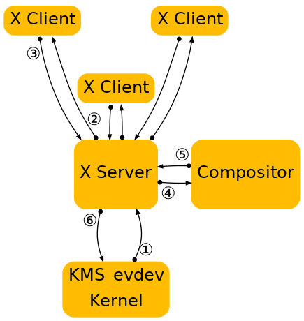
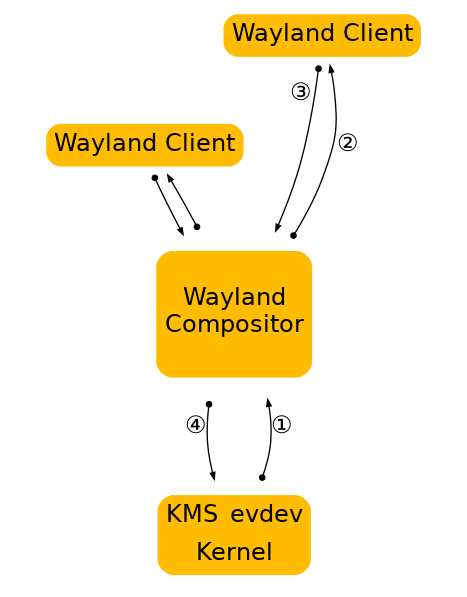

## 第一章. 介绍

### 动机

大多数基于 Linux 和 Unix 的系统都依赖于 X 窗口系统（或者简单的 X）作为构建位图图形界面的低级协议。在这些系统上，X 系统已经发展到包含客户端库、帮助库或主机操作系统内核中可能属于的功能。PCI 资源管理、显示配置管理、直接渲染和内存管理等内容的支持都已经集成到 X 系统中，对独立应用程序的支持有限、其他项目（如 Linux fb 或者 DirectFB 项目）的重复已经组合多个选组的系统（例如 fb 驱动程序和 X 驱动程序之间的 Radeon 内存地图处理或 VT 切换）的复杂性水平很高。

此外，X 系统已经逐渐融入了现代功能，如屏幕外渲染和场景构图，但受限于 X 架构的限制。例如组合的 X 实现上增加了额外的上下文交换，使输入重定向等内容变得困难。

上图说明了 X 服务器和 Compositor 在操作中的核心作用，以及将内容显示到屏幕上所需的步骤。

随着时间的推移，X 开发人员逐渐理解了这种方法的缺点，并努力进行拆分。在过去的几年中，许多功能已经从 X 服务器转移到了客户端库或内核驱动程序中。第一个被移除的组件是字体渲染，freetype 和 fontconfig 提供了核心 X 字体的替代方案。作为客户端库中的图形驱动程序的直接渲染 OpenGL 经过了一些迭代，最终变成了 DRI2，它从客户端代码中抽象出了大部分的直接渲染缓冲区管理。后来，cairo 提供了一个独立于 X 的现代 2D 渲染库，合成管理器接管了桌面渲染的控制权，像 GTK+这样的工具包和 Qt 不再使用 X api 进行渲染。最近，内存和显示管理已经转移到 Linux 内核，进一步缩小了 X 及其驱动程序堆栈的范围。最终的结果是一个高度模块化的图形堆栈。

### 作为显示服务器的合成管理器

Wayland 是一个新的显示服务器和合成协议，而 Weston 是该协议的实现，它构建在上述所有组件之上。我们试图从 X 服务器中提取出现代 Linux 桌面仍在使用的功能。这并不是全部。应用程序可以使用硬件加速库(如 libGL)或高质量的软件实现(如 Cairo 中的那些)，分配自己的屏幕外缓冲区并直接呈现窗口内容。最后，我们需要的是一种显示结果窗口表面的方法，以及在多个客户端之间接收和仲裁输入的方法。这就是 Wayland 所提供的，通过将生态系统中已经存在的组件以略微不同的方式拼凑在一起。

X 将永远是相关的，就像 Fortran 编译器和 VRML 浏览器一样，但现在我们应该考虑将它从关键路径中移除，并将其作为遗留应用程序的可选组件提供。

总的来说，Wayland 的理念是为客户提供一种管理窗口及其内容显示方式的方法。把渲染留给客户端，系统范围内的内存管理接口用于在客户端和合成管理器之间传递缓冲区句柄。

上图说明了 Wayland 客户端如何与 Wayland 服务器交互。请注意，窗口管理和组合完全在服务器中处理，这大大降低了复杂性，同时通过减少上下文切换略微提高了性能。生成的系统比类似的 X 系统更容易构建和扩展，因为通常只需在一个地方进行更改。 或者在协议扩展的情况下，还需要更新窗口管理和/或组合处理的 XICS 中的两个（而不是 3 或 4 的情况）。
