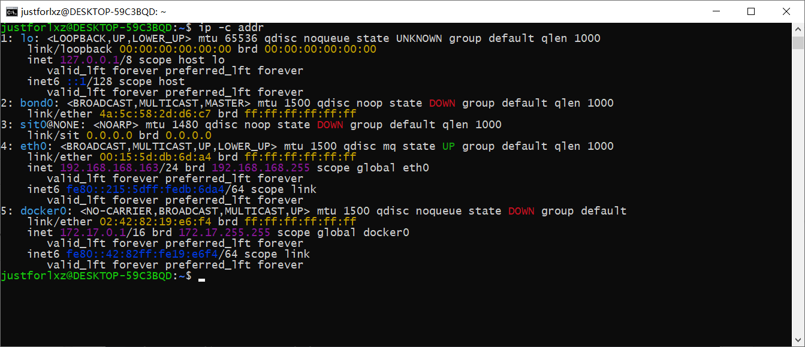
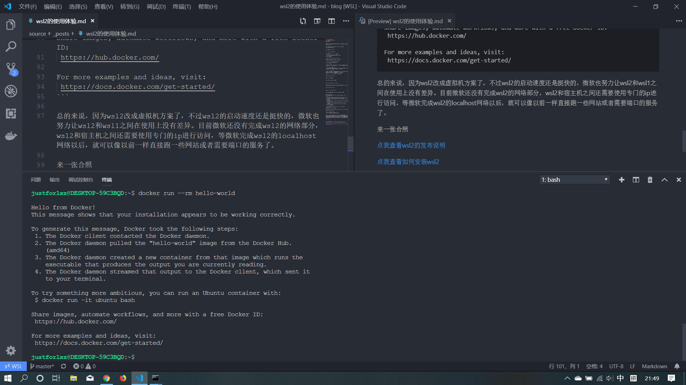

wsl2已经是虚拟机平台了。

<!-- more -->

需要Windows版本在18917及以上，先开启虚拟机平台才能继续，在管理员权限的powershell中执行

```
Enable-WindowsOptionalFeature -Online -FeatureName VirtualMachinePlatform
```

对已安装的wsl1进行转换

```
wsl --set-version <Distro> 2
```

Distro可以通过 `wsl --list` 查看。

转换需要点时间，完成以后就可以浪起来了。

wsl2新增了一些参数：

- `wsl --set-version <Distro> <Version>`

可以设置某个wsl的版本，1是旧版，2是新版。

- `wsl --set-default-version <Version>`

设置默认的wsl版本，推荐设置一下。

- `wsl --shutdown`

出于某些目的，比如已经完成了任务，不再需要wsl工作在后台，可以手动关闭。

- `wsl --list --quiet`

仅列出分发名称，此命令对于脚本编写很有用，因为它只会输出您已安装的发行版的名称，而不显示其他信息，如默认发行版，版本等。

- `wsl --list --verbose`

显示有关所有分发的详细信息。此命令列出每个发行版的名称，发行版所处的状态以及正在运行的版本。它还显示哪些分发是默认的星号。

当一切准备就绪，我就安装了docker，测试一波。

```
sudo apt install docker-ce
```

添加用户到docker组。

```
sudo usermod -aG docker $USER
```

```
sudo service docker --full-restart
```

已经可以跑docker了，我们来做个测试，请出万能的hello world！

```
docker pull hello-world
```

```
docker run --rm hello-world
```

然后就看到了想要的结果，hello world成功的跑起来了。

```
Hello from Docker!
This message shows that your installation appears to be working correctly.

To generate this message, Docker took the following steps:
 1. The Docker client contacted the Docker daemon.
 2. The Docker daemon pulled the "hello-world" image from the Docker Hub.
    (amd64)
 3. The Docker daemon created a new container from that image which runs the
    executable that produces the output you are currently reading.
 4. The Docker daemon streamed that output to the Docker client, which sent it
    to your terminal.

To try something more ambitious, you can run an Ubuntu container with:
 $ docker run -it ubuntu bash

Share images, automate workflows, and more with a free Docker ID:
 https://hub.docker.com/

For more examples and ideas, visit:
 https://docs.docker.com/get-started/
```

总的来说，因为wsl2改成虚拟机方案了，不过wsl2的启动速度还是挺快的，微软也努力让wsl2和wsl1之间在使用上没有差异。目前微软还没有完成wsl2的网络部分，wsl2和宿主机之间还需要使用专门的ip进行访问，等微软完成wsl2的localhost网络以后，就可以像以前一样直接跑一些网站或者需要端口的服务了。



来一张合照



[点我查看wsl2的发布说明](https://devblogs.microsoft.com/commandline/wsl-2-is-now-available-in-windows-insiders/)

[点我查看如何安装wsl2](https://docs.microsoft.com/en-us/windows/wsl/wsl2-install)
