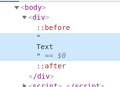
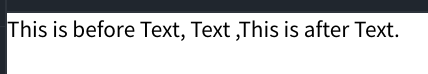

我最早接触到CSS中的伪元素是在一次写背景模糊的时候，CSS中的blur会模糊下面所有的元素，但是可以通过伪元素在before中先模糊，这样下层是没有任何元素的，自然也不会有元素被模糊。

伪元素就如同它的名字一样，是假的元素，只是CSS引擎在排版的时候创建出来的，在DOM树中是不存在的，所以javascript是没办法操作伪元素的。伪元素分为before和after，可以在元素的前面或者后面创建一个假的元素，伪元素选择器的标志符号是`::`。

1. `div::before` 在div元素的前面创建一个元素，配合content属性一起使用。
2. `div::after` 在div元素的后面创建一个元素，配合content属性一起使用。



使用伪元素选择器需要注意一点的是，必须使用content属性，否则将不起任何作用。

伪元素选择器生效以后，可以在DOM中看到::before或者::after，这里提供一个例子。

html部分：
```
<body>
    <div>
        Text
    </div>
</body>
```

css部分：
```
div::before {
  content: "This is before Text, ";
}

div::after {
  content: ", This is after Text.";
}
```

此时页面上会看到输出这么一句话，`This  is before Text, Text , This is after Text.`，并且使用鼠标只能选择到最中间的Text文本。



代码可以点击[这里](https://jsfiddle.net/justforlxz/shg21kvb/18/)查看。

今天写这篇文章呢，是因为今天我在实现hexo的Next主题，看到它在列表中使用after创建了一个小圆点，并且我遇到了一个问题，所以写这篇文章记录一下。

Next用的是浮动布局来实现的，而我决定flex一把梭，整体布局是垂直的flex，首页、分类等列表内部是用水平的inline-flex实现的，最左边是图标，来自fortawesome，中间的文本使用span包裹一下，实现左对齐，然后通过伪元素在最右边创建一个小圆点，设置a元素的宽度为100%，就可以实现圆点在最右边。

坑就是在这里遇到的，如果a元素的宽度设置为100%，伪元素创建的小圆点就不能完全显示，少1像素或者多1像素就可以完全显示。最终的解决办法是给小圆点的周围增加了1像素的padding解决了，但是原因位置，谁看到这篇文章并且恰好知道原因的，还请帮忙评论回复一下。

```
<div id="site-nav">
  <ul>
    <li v-for="item in items" v-bind:key="item.title">
      <a v-bind:href="item.link">
        <span id="menu-left" v-bind:class="item.class"></span>
        <span id="menu-text">
          {{ item.title }}
        </span>
      </a>
    </li>
  </ul>
</div>
```

```
#site-nav {
  background: white;
  padding: 20px 0;
}

ul {
  margin: 0;
  padding: 0 0;
}

#site-nav li {
  list-style-type: none;
}

#site-nav li a {
  padding: 5px 0px;
  text-align: left;
  line-height: inherit;
  transition-property: background-color;
  transition-duration: 0.2s;
  transition-timing-function: ease-in-out;
  transition-delay: 0s;
  display: flex;
  justify-content: space-between;
  align-items: center;
  text-decoration: none;
  font-size: 13px;
  border-bottom: 1px solid transparent;
  color: #555;
}

#site-nav li a:hover {
  background: #f9f9f9;
}

#menu-left {
  align-content: center;
  margin-left: 10px;
}

#menu-text {
  width: 100%;
  margin-left: 10px;
}

#site-nav li a::after {
  content: ' ';
  background: #bbb;
  width: 6px;
  height: 6px;
  border-radius: 50%;
  margin: 0 10px 0 0;
  min-width: 6px;
  min-height: 6px;
  max-height: 6px;
  max-width: 6px;
  display: block;
  box-sizing: border-box;
}
```

但我提取了基本结构和css，demo是能够正常显示小圆点的，但是自己的Vue却不能正常显示，后来发现是display写成块级元素用的flex了，改成inline-flex就能正常显示了，但是在调整宽度的时候，就发现了上面的问题，它又不正常显示了，实在解决不了了，就用padding处理了。

参考资料： [千古壹号](https://github.com/qianguyihao/Web/blob/master/02-CSS%E5%9F%BA%E7%A1%80/10-CSS3%E9%80%89%E6%8B%A9%E5%99%A8%E8%AF%A6%E8%A7%A3.md)
