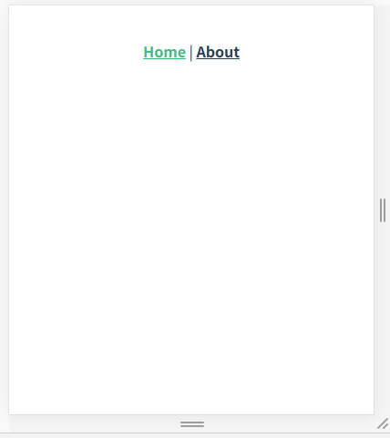

今天算是正式入坑 typescript 了，基于 vue 写了第一个函数，用来做一个文字效果。

演示效果：


<!-- more -->

整体思路听简单的，就是用定时器和延时器来做，通过定时器来间隔的处理文本，延时器来延后所有的方法。

```
class TextHandle {
    private allDuration: number = 0;
    public appendText(text: string) : void {
        setTimeout(() = >{
            const LeftMessage = document.getElementById('LeftMessage');
            if (LeftMessage === null) {
                return;
            }

            let index: number = 0;
            const MessageText: string = LeftMessage.innerText;

            // tslint:disable-next-line:only-arrow-functions
            const interval = setInterval(function() {
                if ((LeftMessage === null) || (index++ === text.length + 1)) {
                    return clearInterval(interval);
                }

                LeftMessage.innerText = MessageText + text.substring(0, index);
            },
            300);
        },
        this.AllDuration);
        this.AllDuration += text.length * 300 + 100;
    }
}
```

typescript确实挺不错的，平时都在写静态语言，如C++，所以当我开始学动态语言的时候，就会觉得水土不服，现在
通过typescript就可以让我继续使用静态语言的开发方式来写web，而且代码更容易理解。
