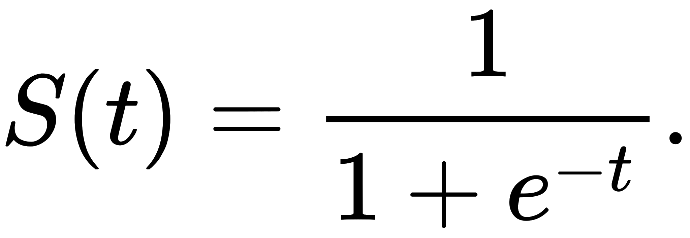
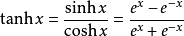
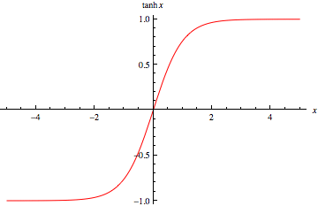
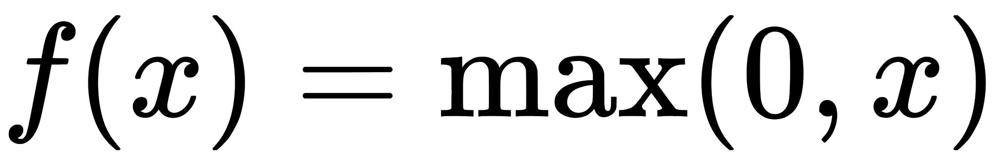
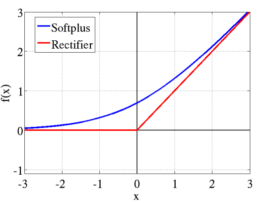

前言： 我太菜了… 本来想着写个小例子，结果写到一半发现自己其实根本不会，我还是撸C++去吧。

卷积神经网络(Convolutional Neural Network)是一种前馈神经网络。它的人工神经元可以响应一部分覆盖范围内的周围单元，对于大型图像处理有出色的表现。

卷积神经网络由一个或多个卷积层和顶端的全连通层组成，同时也包含关联权重和池化层。这一结构可以使得卷积神经网络能够利用输入数据的二维结构。与其他深度学习结构相比，卷积神经网络在图像和声音上能够给出更好的结果，这一模型也可以用反向传播算法进行训练。相比较于其他神经网络、前馈神经网络，卷积神经网络需要考虑的参数更少，使之成为一种颇具吸引力的深度学习结构。

<!-- more -->

## 结构

### 卷积层

卷积神经网络中每层卷积层由若干卷积单元构成。每个卷积单元的参数都可以由反向传播算法来调整。卷积运算的目的是提取输入的不同特征，第一层卷积可能只提取非常小的特征，更多层的网络只能从低级特征中提取更复杂的特征。

### 激活函数

运行时激活神经网络中某一部分神经元，将激活信息向后传入下一层神经网络。神经网络之所以能解决非线性问题，如语音和图像，本质上就是激活函数加入了非线性的因素，弥补了线性模型的表达力，把“激活的神经元的特征”通过函数保留并映射到下一层。

因为神经网络的数学基础是处处可微，所以选取的激活函数要能保证数据输入与输出也是可微的，介绍四种函数：

- sigmoid

sigmoid函数是传统神经网络中最常用的激活函数之一，它的优点在于，它的输出映射在(0, 1)内，单调连续，非常适合作为输出层，并且求导比较容易，缺点也比较明显，因为软饱和性，一旦落入饱和区，f'(x)就会变得接近0，很容易产生阶梯消失。

- tanh

tanh函数也具有软饱和性，因为它的输出以0为中心，收敛速度比sigmoid要快，但是仍然无法解决梯度消失问题。

- relu

relu是目前最受欢迎的激活函数，softplus可以看做是relu的平滑版本。使用线性整流（Rectified Linear Units, ReLU）f(x)=max(0,x)作为这一层神经的激励函数（Activation function）。它可以增强判定函数和整个神经网络的非线性特性，而本身并不会改变卷积层。

- dropout

一个神经元将以概率决定是否要被抑制，被抑制的神经元会被暂时认为不属于网络，但是它的权重将会被保留。

### 池化层

池化是卷积神经网络中另外一个非常重要的概念。它实际上是形式的降采样。有多种不同形式的非线性池化函数，而其中“最大池化”是最为常见的。它是将输入的图像划分为若干个矩形区域，对每个子区域输出最大值。直觉上，这种机制能够有效地原因在于，在发现一个特征之后，它的精确位置远不及它和其他特征的相对位置的关系重要。池化层会不断地减小数据的空间大小，因此参数的数量和计算量也会下降，这在一定程度上也控制了过拟合。通常来说，CNN的卷积层之间都会周期性地插入池化层。

池化层通常会分别作用于每个输入的特征并减小其大小。目前最常用形式的池化层是每隔2个元素从图像划分出2x2的区块，然后对每个区块中的4个数取最大值。这将会减少75%的数据量。

除了最大池化之外，池化层也可以使用其他池化函数，例如“平均池化”甚至“L2-范数池化”等。过去，平均池化的使用曾经较为广泛，但是最近由于最大池化在实践中的表现更好，平均池化已经不太常用。

由于池化层过快地减少了数据的大小，目前文献中的趋势是使用较小的池化滤镜，甚至不再使用池化层。

### 损失函数层

损失函数层用于决定训练过程如何来“惩罚”网络的预测结果和真实结果之间的差异，它通常是网络的最后一层。各种不同的损失函数适用于不同类型的任务。例如，Softmax交叉熵损失函数常常被用于在K个类别中选出一个，而Sigmoid交叉熵损失函数常常用于多个独立的二分类问题。欧几里德损失函数常常用于结果取值范围为任意实数的问题。
