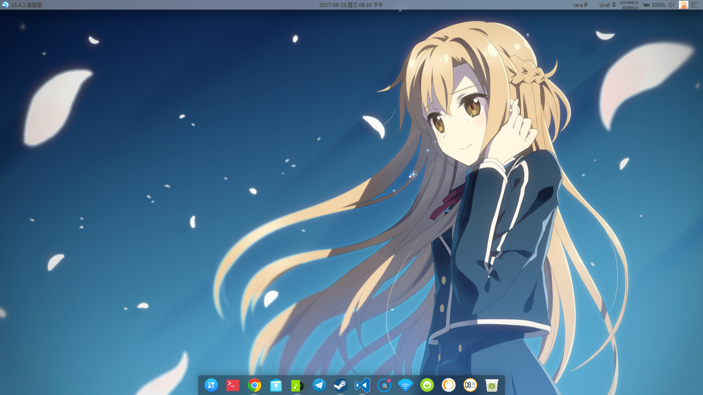
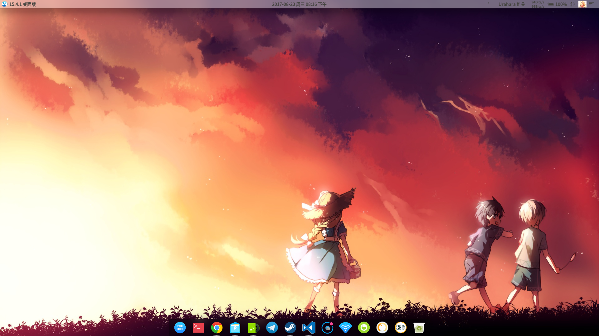

这里记录了开发topbar中遇到的坑和一些问题。

<!-- more -->

使用Qt提供的qxcb方法注册阴影为dock类型，反而处于DESKTOP和NORMAL之间。其实当初并不是想设置为DOCK类型的，因为这样阴影也会在窗口上方，我希望的是阴影在普通程序下方，在桌面上方。今天曹哥来讲窗管的一些坑，讲到窗管是如何控制窗口的，我的阴影其实是被Qt注册成_NET_WM_STATE_BELOW了。
[这里可以看到一些type的介绍](https://specifications.freedesktop.org/wm-spec/1.3/ar01s05.html)。

在_NET_WM_STATE中一共有这么几个类型：

```
_NET_WM_STATE_MODAL, ATOM
_NET_WM_STATE_STICKY, ATOM
_NET_WM_STATE_MAXIMIZED_VERT, ATOM
_NET_WM_STATE_MAXIMIZED_HORZ, ATOM
_NET_WM_STATE_SHADED, ATOM
_NET_WM_STATE_SKIP_TASKBAR, ATOM
_NET_WM_STATE_SKIP_PAGER, ATOM
_NET_WM_STATE_HIDDEN, ATOM
_NET_WM_STATE_FULLSCREEN, ATOM
_NET_WM_STATE_ABOVE, ATOM
_NET_WM_STATE_BELOW, ATOM
_NET_WM_STATE_DEMANDS_ATTENTION, ATOM

```

如果程序被注册成_NET_WM_STATE_BELOW，则会被放置在DESKTOP之上的一层。不是很清楚Qt是出于什么策略，才把我的阴影注册为这个状态，反而是刚好满足了我的需求。

这要多谢曹哥了，我才终于明白了为什么会这样，以及以后如何正确的设置type。




